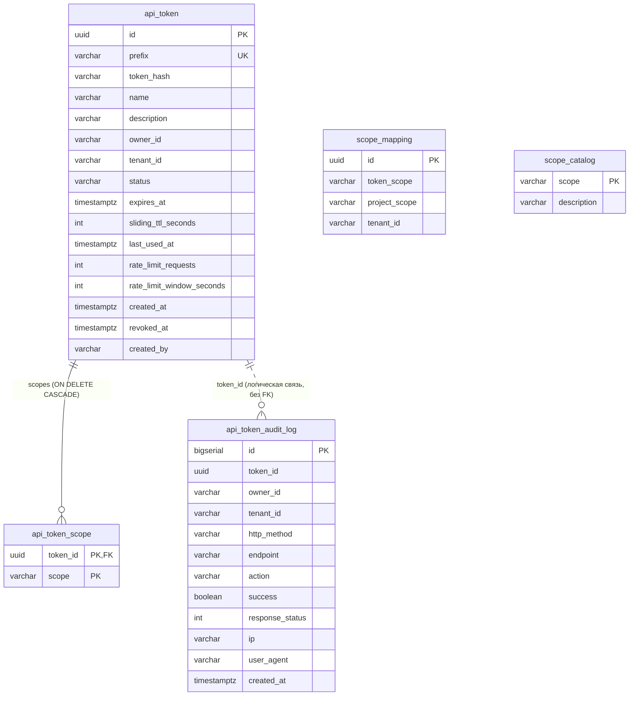

# Модель данных

Схема поставляется вместе с библиотекой двумя Flyway-миграциями в модуле
`openapi-tokens-persistence-jpa`:

| Миграция | Что создаёт |
|---|---|
| `db/migration/V1__api_tokens.sql` | `api_token`, `api_token_scope`, `scope_mapping`, `api_token_audit_log` |
| `db/migration/V2__scope_catalog.sql` | `scope_catalog` |

Все имена таблиц и колонок заданы в `@Table`/`@Column` явно (snake_case), поэтому стратегия
именования Spring Boot на схему не влияет. Типы времени — `TIMESTAMPTZ` (UTC-семантика).

!!! warning "Миграции приходят из библиотеки"
    Это **единственный** модуль в репозитории с каталогом `db/migration`, то есть Flyway
    по умолчанию (`spring.flyway.locations=classpath:db/migration`) подхватит эти файлы из jar.
    Номера `V1`/`V2` становятся глобальными для истории миграций приложения:
    - нельзя заводить в продукте свои файлы с такими же именами;
    - нельзя перенумеровывать миграции после релиза;
    - свою историю можно изолировать настройкой `spring.flyway.table`.

## ER-диаграмма



## DDL

### `V1__api_tokens.sql`

```sql
CREATE TABLE api_token (
    id                      UUID PRIMARY KEY,
    prefix                  VARCHAR(16)  NOT NULL,
    token_hash              VARCHAR(255) NOT NULL,
    name                    VARCHAR(128) NOT NULL,
    description             VARCHAR(512),
    owner_id                VARCHAR(128) NOT NULL,
    tenant_id               VARCHAR(128),
    status                  VARCHAR(32)  NOT NULL,
    expires_at              TIMESTAMPTZ,
    sliding_ttl_seconds     INT,
    last_used_at            TIMESTAMPTZ,
    rate_limit_requests     INT,
    rate_limit_window_seconds INT,
    created_at              TIMESTAMPTZ  NOT NULL,
    revoked_at              TIMESTAMPTZ,
    created_by              VARCHAR(128),
    CONSTRAINT uq_api_token_prefix UNIQUE (prefix)
);

CREATE INDEX idx_api_token_owner_id ON api_token (owner_id);
CREATE INDEX idx_api_token_tenant_id ON api_token (tenant_id);
CREATE INDEX idx_api_token_prefix ON api_token (prefix);

CREATE TABLE api_token_scope (
    token_id UUID         NOT NULL,
    scope    VARCHAR(128) NOT NULL,
    PRIMARY KEY (token_id, scope),
    CONSTRAINT fk_api_token_scope_token
        FOREIGN KEY (token_id) REFERENCES api_token (id) ON DELETE CASCADE
);

CREATE TABLE scope_mapping (
    id             UUID PRIMARY KEY,
    token_scope    VARCHAR(128) NOT NULL,
    project_scope  VARCHAR(128) NOT NULL,
    tenant_id      VARCHAR(128),
    CONSTRAINT uq_scope_mapping UNIQUE (token_scope, project_scope, tenant_id)
);

CREATE TABLE api_token_audit_log (
    id              BIGSERIAL PRIMARY KEY,
    token_id        UUID,
    owner_id        VARCHAR(128),
    tenant_id       VARCHAR(128),
    http_method     VARCHAR(16),
    endpoint        VARCHAR(512),
    action          VARCHAR(128),
    success         BOOLEAN      NOT NULL,
    response_status INT,
    ip              VARCHAR(64),
    user_agent      VARCHAR(512),
    created_at      TIMESTAMPTZ  NOT NULL
);

CREATE INDEX idx_api_token_audit_log_token_created
    ON api_token_audit_log (token_id, created_at);
CREATE INDEX idx_api_token_audit_log_created
    ON api_token_audit_log (created_at);
```

### `V2__scope_catalog.sql`

```sql
CREATE TABLE scope_catalog (
    scope       VARCHAR(128) PRIMARY KEY,
    description VARCHAR(512)
);

COMMENT ON TABLE scope_catalog IS 'Human readable descriptions of token scopes; overrides openapi.tokens.scopes.catalog';
```

## Описание таблиц

### `api_token` — токены

| Колонка | Тип | Null | Соответствие в домене | Комментарий |
|---|---|---|---|---|
| `id` | `UUID` | ✗ | `ApiToken#id` | Генерируется приложением (`UUID.randomUUID()`), не БД |
| `prefix` | `VARCHAR(16)` | ✗ | `credentials().prefix()` | Уникален; по нему идёт поиск |
| `token_hash` | `VARCHAR(255)` | ✗ | `credentials().tokenHash()` | Argon2id/BCrypt-строка |
| `name` | `VARCHAR(128)` | ✗ | `name` | Ограничение длины = `@Size(max=128)` |
| `description` | `VARCHAR(512)` | ✓ | `description` | `@Size(max=512)` |
| `owner_id` | `VARCHAR(128)` | ✗ | `ownerId` | Строка из security context; FK на пользователей нет |
| `tenant_id` | `VARCHAR(128)` | ✓ | `tenantId` | Мультитенантность (опционально) |
| `status` | `VARCHAR(32)` | ✗ | `status` | `@Enumerated(EnumType.STRING)`: `ACTIVE`/`BLOCKED`/`REVOKED`/`EXPIRED` |
| `expires_at` | `TIMESTAMPTZ` | ✓ | `expiry().expiresAt()` | Абсолютный TTL |
| `sliding_ttl_seconds` | `INT` | ✓ | `expiry().slidingTtl()` | Скользящий TTL в секундах |
| `last_used_at` | `TIMESTAMPTZ` | ✓ | `expiry().lastUsedAt()` | Обновляется только при успешной аутентификации |
| `rate_limit_requests` | `INT` | ✓ | `rateLimit().requests()` | Лимит запросов |
| `rate_limit_window_seconds` | `INT` | ✓ | `rateLimit().windowSeconds()` | Окно лимита |
| `created_at` | `TIMESTAMPTZ` | ✗ | `createdAt` | Заполняется из бина `Clock` |
| `revoked_at` | `TIMESTAMPTZ` | ✓ | `revokedAt` | Момент отзыва |
| `created_by` | `VARCHAR(128)` | ✓ | `createdBy` | Всегда `ownerId` в текущей реализации |

Индексы: `api_token_pkey(id)`, `uq_api_token_prefix(prefix)` (уникальный),
`idx_api_token_owner_id(owner_id)`, `idx_api_token_tenant_id(tenant_id)`,
`idx_api_token_prefix(prefix)`.

!!! bug "`idx_api_token_prefix` — избыточный индекс"
    PostgreSQL уже создаёт индекс для ограничения `uq_api_token_prefix UNIQUE (prefix)`.
    Дополнительный `idx_api_token_prefix(prefix)` дублирует его и только замедляет
    вставку/обновление. Его можно удалить отдельной миграцией в продукте:

    ```sql
    DROP INDEX idx_api_token_prefix;
    ```

### `api_token_scope` — скоупы токена

| Колонка | Тип | Null | Комментарий |
|---|---|---|---|
| `token_id` | `UUID` | ✗ | Часть составного PK, FK на `api_token(id)` c `ON DELETE CASCADE` |
| `scope` | `VARCHAR(128)` | ✗ | Часть составного PK; порядок не сохраняется, дубликаты невозможны |

Маппинг: `@ElementCollection(fetch = LAZY)` + `@CollectionTable` + `Set<String>`.
Отдельного суррогатного ключа и колонки порядка нет (используется `Set`, не `List`).

### `scope_mapping` — маппинги скоупов 1:M

| Колонка | Тип | Null | Комментарий |
|---|---|---|---|
| `id` | `UUID` | ✗ | PK; если не задан, адаптер генерирует `UUID.randomUUID()` |
| `token_scope` | `VARCHAR(128)` | ✗ | Скоуп токена (внешнее имя) |
| `project_scope` | `VARCHAR(128)` | ✗ | Право приложения (authority) |
| `tenant_id` | `VARCHAR(128)` | ✓ | `NULL` = общая строка для всех тенантов |

Ограничение: `uq_scope_mapping(token_scope, project_scope, tenant_id)`.

!!! bug "Дубли логических строк возможны"
    `tenant_id` допускает `NULL`, а PostgreSQL считает `NULL`-значения различными
    в уникальном индексе. Поэтому строку `('payment','createPayment', NULL)` можно вставить
    многократно. `JpaScopeMappingRepository#save` при `id == null` всегда генерирует новый
    UUID, то есть повторное сохранение «той же» пары создаёт **новую строку**, а не обновляет
    существующую. Загружая маппинги из внешнего источника, используйте upsert по
    `(token_scope, project_scope, COALESCE(tenant_id,''))` или заполняйте `id` самостоятельно.

### `scope_catalog` — справочник описаний

| Колонка | Тип | Null | Комментарий |
|---|---|---|---|
| `scope` | `VARCHAR(128)` | ✗ | Натуральный PK (суррогатного id нет) |
| `description` | `VARCHAR(512)` | ✓ | `NULL` → описание берётся из конфигурации |

Порядок строк не определён (`findAll()` отдаёт порядок БД) — сортировку делает
`DefaultScopeCatalog` (`TreeSet` по имени скоупа).

### `api_token_audit_log` — журнал аудита

| Колонка | Тип | Null | Комментарий |
|---|---|---|---|
| `id` | `BIGSERIAL` | ✗ | PK, sequence `api_token_audit_log_id_seq`, `GenerationType.IDENTITY` |
| `token_id` | `UUID` | ✓ | **Внешнего ключа нет** — записи переживают удаление токена |
| `owner_id` | `VARCHAR(128)` | ✓ | Может быть `NULL` для неопознанного токена |
| `tenant_id` | `VARCHAR(128)` | ✓ | |
| `http_method` | `VARCHAR(16)` | ✓ | |
| `endpoint` | `VARCHAR(512)` | ✓ | Путь без query-строки |
| `action` | `VARCHAR(128)` | ✓ | Сейчас всегда `AUTHENTICATE` |
| `success` | `BOOLEAN` | ✗ | Результат аутентификации |
| `response_status` | `INT` | ✓ | 200 / 401 / 429 |
| `ip` | `VARCHAR(64)` | ✓ | `getRemoteAddr()` — за прокси это адрес прокси |
| `user_agent` | `VARCHAR(512)` | ✓ | Обрезается БД при превышении (или падает, см. ниже) |
| `created_at` | `TIMESTAMPTZ` | ✗ | |

Индексы: `(token_id, created_at)` — под запросы карточки токена; `(created_at)` — под уборку
по времени. Индексов по `owner_id`, `tenant_id`, `success`, `action` нет.

!!! warning "Длинные значения приводят к ошибке вставки"
    `endpoint VARCHAR(512)`, `user_agent VARCHAR(512)`, `ip VARCHAR(64)` — жёсткие лимиты
    без валидации на стороне Java. Слишком длинный `User-Agent` или путь вызовут ошибку
    вставки; так как запись аудита асинхронная, пользователь её не увидит, а в логе появится
    `Failed to append audit event for token …`. Учитывайте при аномально длинных URL
    (например, с токенами в пути) — их стоит маскировать/обрезать своим `AuditRecorder`.

## Инварианты и соответствие домену

| Инвариант | Где обеспечен | Что будет при нарушении |
|---|---|---|
| Хотя бы один непустой скоуп | `ApiToken.normalizeScopes` → `EmptyScopesException` | 400 `Invalid Token Request` |
| `name` не пустое, ≤ 128 | DTO `@NotBlank @Size(max=128)` + домен | 400 `Validation Failed` |
| `prefix` уникален | БД `uq_api_token_prefix` | `DataIntegrityViolationException` → 500 (не обрабатывается) |
| Только разрешённые переходы статусов | `ApiToken#revoke/block/unblock` | 400 `Invalid Token Request` |
| Скоупы не пустые, без дублей, обрезаны | `ApiToken.normalizeScopes` | — |
| Схема соответствует миграциям | `spring.jpa.hibernate.ddl-auto=validate` | Приложение не стартует |

!!! note "`ddl-auto=validate` проверяет не всё"
    Hibernate валидирует наличие таблиц, колонок и совместимость типов, но **не** проверяет
    длины (`@Column(length=…)`), уникальные ограничения, индексы и внешние ключи.
    Так, `token_hash` в сущности не имеет `length`, и используется умолчание Hibernate (255),
    совпадающее с DDL. Расхождения в длинах и индексах остаются незамеченными.

## Чего в схеме нет

| Отсутствует | Следствие |
|---|---|
| Таблица пользователей/владельцев | `owner_id` ничем не подтверждается; «висячие» токены после удаления пользователя |
| `updated_at` и `@Version` | Оптимистичной блокировки нет: параллельные изменения одного токена — «последний победил» |
| FK `api_token_audit_log.token_id → api_token.id` | Возможны «осиротевшие» записи аудита |
| Индекс по `status`, `expires_at` | Нет запросов «все активные»/«все истекающие» в текущем коде; при их добавлении понадобится индекс |
| Партиционирование журнала | Таблица аудита растёт неограниченно |
| Таблица отозванных/удалённых токенов | Удаление токена (если появится) уничтожит и его скоупы (CASCADE) |

## Миграции и эксплуатация

```bash
# поднять БД для локальной разработки
docker compose up -d

# применить миграции (в демо-приложении Flyway включён)
./gradlew :openapi-tokens-sample:bootRun
```

| Тема | Рекомендация |
|---|---|
| Существующая БД продукта | Миграции не конфликтуют по именам таблиц (`api_token*`, `scope_*`), но занимают версии `V1`, `V2`. Если в продукте уже есть свои `V1`/`V2` — переименуйте файлы библиотеки до первого применения (например, `V100__…`) или используйте `spring.flyway.table` |
| Продакшен-индексы | Удалите `idx_api_token_prefix`; при росте журнала добавьте индекс по `created_at` (есть) и рассмотрите партиционирование |
| Ретеншн аудита | Регулярная задача `DELETE FROM api_token_audit_log WHERE created_at < now() - interval '90 days'` или партиции |
| Мониторинг | Следите за размером `api_token_audit_log` и за логом `Failed to append audit event for token` |
| Бэкапы | Достаточно обычного бэкапа БД: секреты в БД не хранятся в открытом виде |

## Связанные разделы

- [Жизненный цикл токена](../features/token-lifecycle.md) — как поля меняются во времени.
- [Аудит и статистика](../features/audit.md) — запросы к журналу.
- [Скоупы и права](../features/scopes.md) — семантика `scope_mapping` и `scope_catalog`.
- [Ограничения и roadmap](../operations/roadmap.md) — что планируется исправить.
