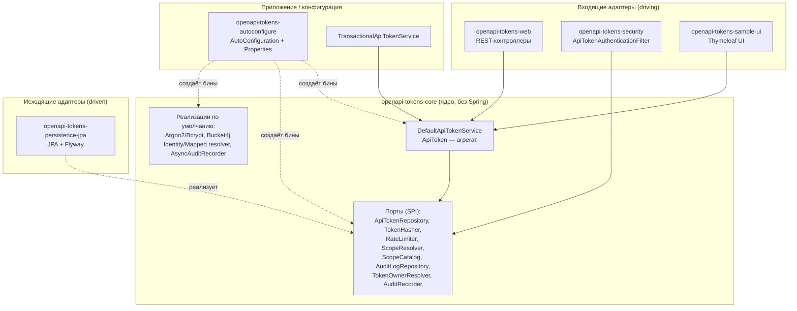
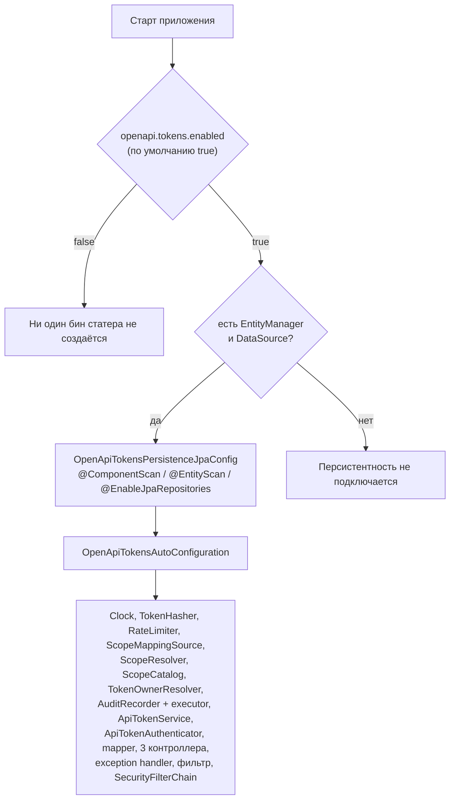
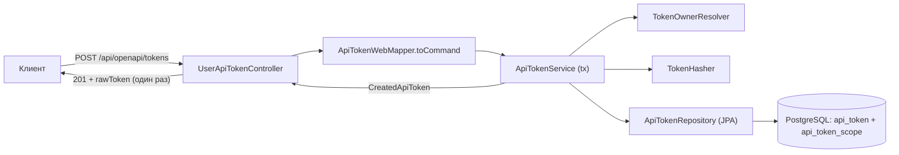
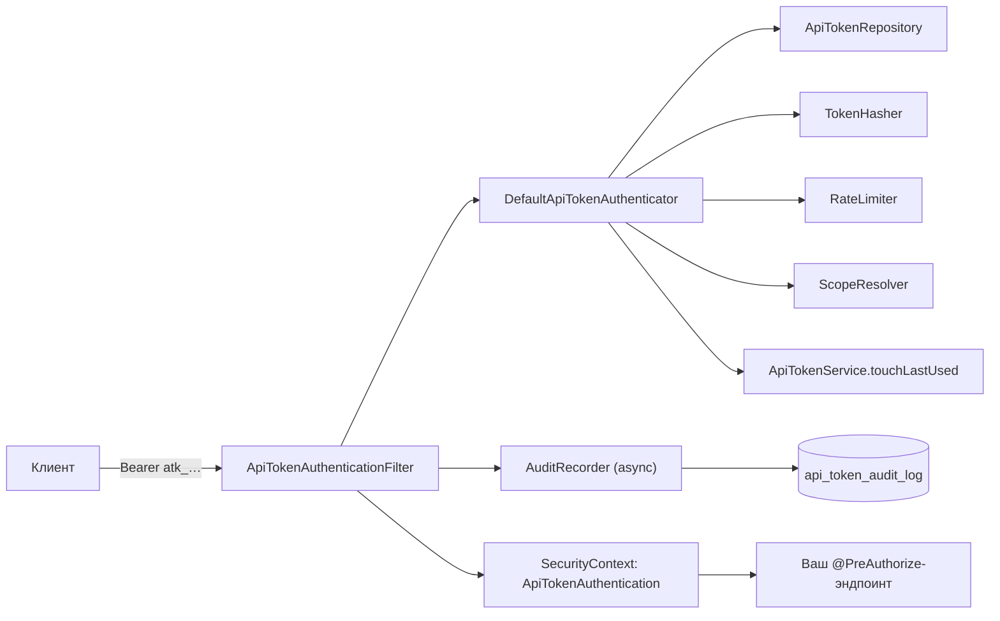
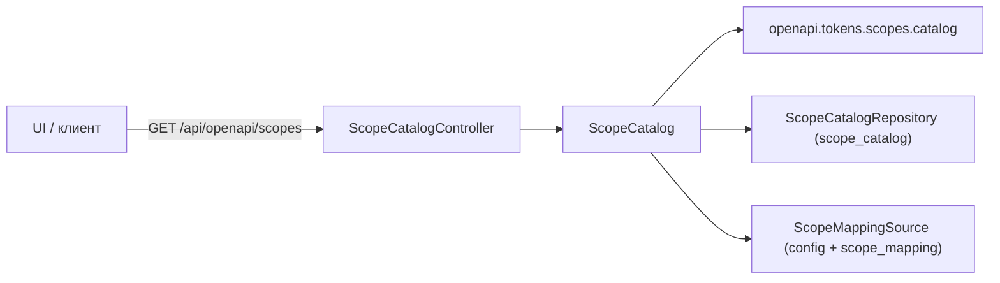
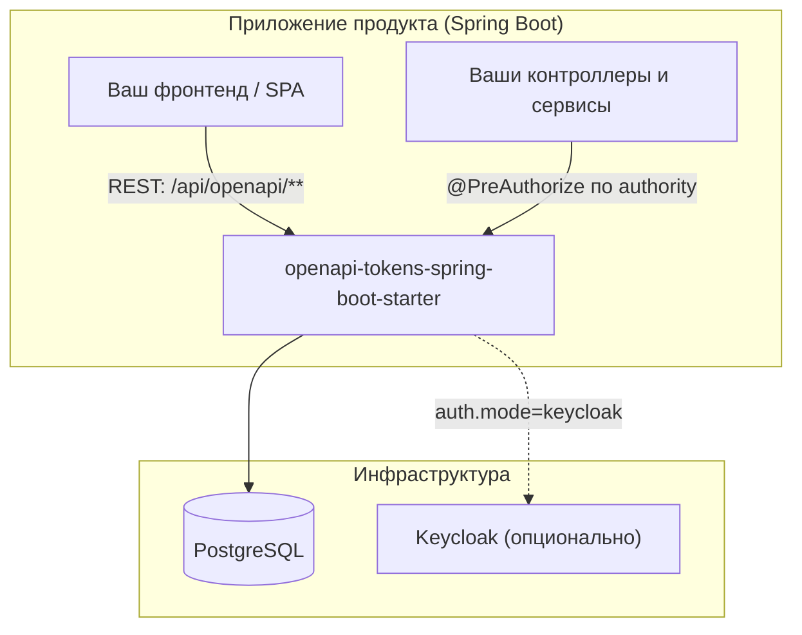

# Обзор архитектуры

Библиотека построена по принципам **гексагональной (порты и адаптеры)** архитектуры:
ядро ничего не знает о Spring, JPA и HTTP, а всё внешнее подключается адаптерами.
Это позволяет использовать ядро отдельно и заменять любой адаптер без изменения бизнес-логики.

## Слои



| Слой | Модуль | Зависимости | Ответственность |
|---|---|---|---|
| Домен и порты | `openapi-tokens-core` | Только Argon2, BCrypt, Bucket4j, SLF4J | Инварианты токена, команды, TTL, порты, сервис, резолверы скоупов, rate limiter, асинхронный аудит |
| Персистентность | `openapi-tokens-persistence-jpa` | core + Spring Data JPA + Flyway + PostgreSQL | Сущности, репозитории Spring Data, адаптеры портов, миграции |
| Безопасность | `openapi-tokens-security` | core + Spring Security + Spring Web | Фильтр, `AuthenticationProvider`, `Authentication`, `PermissionEvaluator`, резолверы владельца |
| HTTP-адаптер | `openapi-tokens-web` | core + security + Spring Web/Validation | Контроллеры, DTO, маппер, обработчик ошибок |
| Конфигурация | `openapi-tokens-autoconfigure` | core + persistence + security + web | Авто-конфигурация, свойства, транзакционный декоратор, готовая цепочка безопасности |
| Агрегатор | `openapi-tokens-spring-boot-starter` | все модули (api) | Точка подключения для продуктов |
| Демо (`internal`) | `openapi-tokens-sample` | starter + UI-модуль | Пример интеграции: REST, form login, демо-API |
| Библиотека UI | `openapi-tokens-sample-ui` | starter + Thymeleaf | Общий server-rendered интерфейс пользователя и администратора |
| Демо (`keycloak`) | `openapi-tokens-sample-keycloak` | starter + UI-модуль + oauth2 client/resource-server | OIDC-вход через Keycloak, приём Keycloak JWT и API-токена, маппинг ролей |

**Направление зависимостей** (проверяется ArchUnit-тестом в модуле персистентности):
`core` не зависит ни от чего, кроме библиотек хеширования/лимитов; `dto` не знает про `@Entity`;
`@Entity` не знает про `dto`.

## Ядро: домен и порты

### Доменная модель

| Тип | Роль |
|---|---|
| `ApiToken` | Агрегат-корень. Неизменяемый, строится через `Builder`, переходы (`revoke`, `block`, `unblock`, `markExpired`, `touchLastUsed`) возвращают новые экземпляры и проверяют инварианты |
| `TokenCredentials` | Пара «публичный префикс + хеш секрета» |
| `RawToken` | Сырой токен `atk_<prefix>_<secret>`: генерация (`SecureRandom`), парсинг, валидация формата |
| `TokenExpiry` | Абсолютный срок, скользящий TTL, `lastUsedAt`, метод `isExpired(Clock)` |
| `TokenStatus` | `ACTIVE`, `BLOCKED`, `REVOKED`, `EXPIRED` |
| `RateLimitPolicy` | `requests` + `windowSeconds`; `unlimited()` |
| `TokenOwner` | `ownerId` + `tenantId` из security context |
| `ScopeInfo`, `ScopeCatalogEntry`, `ScopeMapping` | Справочник скоупов и маппинги 1:M |
| `AuditEvent` | Событие аудита |
| `CreatedApiToken` | Результат создания: агрегат + одноразовый сырой токен |
| `TokenUsageStats` | Агрегированная статистика |

Команды (`CreateTokenCommand`, `RevokeTokenCommand`, `BlockTokenCommand`) — неизменяемые
record-объекты, отделяющие входные данные от домена.

### Порты (SPI)

| Порт | Назначение | Реализация по умолчанию |
|---|---|---|
| `ApiTokenRepository` | Хранение токенов | `JpaApiTokenRepository` |
| `AuditLogRepository` | Хранение и агрегация событий | `JpaAuditLogRepository` |
| `ScopeCatalogRepository` | Описания скоупов | `JpaScopeCatalogRepository` |
| `ScopeMappingRepository` | Маппинги 1:M | `JpaScopeMappingRepository` |
| `TokenHasher` | Хеширование секретов | `Argon2TokenHasher` / `BcryptTokenHasher` |
| `RateLimiter` | Лимиты на токен | `Bucket4jRateLimiter` |
| `ScopeResolver` | Скоупы → authority | `IdentityScopeResolver` / `MappedScopeResolver` |
| `ScopeCatalog` | Read-API справочника | `DefaultScopeCatalog` |
| `TokenOwnerResolver` | Владелец из security context | `InternalTokenOwnerResolver` / `KeycloakTokenOwnerResolver` |
| `AuditRecorder` | Запись событий | `AsyncAuditRecorder` |
| `ApiTokenAuthenticator` | Проверка сырого токена | `DefaultApiTokenAuthenticator` |
| `ApiTokenPermissionChecker` | Программные проверки прав | `ApiTokenPermissionEvaluator` |
| `ApiTokenService` | Прикладной сервис жизненного цикла | `TransactionalApiTokenService` → `DefaultApiTokenService` |

Подробное описание каждого порта и примеры замены — [Порты и точки расширения](../api/spi.md).

## Авто-конфигурация

Подключается через `META-INF/spring/org.springframework.boot.autoconfigure.AutoConfiguration.imports`
(одинаковый в модулях `autoconfigure` и `spring-boot-starter`):

```
ru.openapi.tokens.autoconfigure.OpenApiTokensPersistenceAutoConfiguration
ru.openapi.tokens.autoconfigure.OpenApiTokensAutoConfiguration
```



Ключевые правила:

- **Главный переключатель** — `openapi.tokens.enabled` (`matchIfMissing = true`): при `false`
  не создаётся ни один бин статера.
- **Почти каждый бин** объявлен с `@ConditionalOnMissingBean` → любой компонент заменяется
  собственным бином без правки библиотеки.
- **Персистентность** включается только при наличии `jakarta.persistence.EntityManager`
  и бина `DataSource`; иначе JPA-адаптеры не регистрируются (и `AuditLogRepository` будет
  отсутствовать — тогда статистика вернёт нули).
- **Резолвер владельца** выбирается свойством `openapi.tokens.auth.mode`: `internal`
  (по умолчанию) или `keycloak` (+ требуется класс из `spring-security-oauth2-resource-server`).
- **`AuthenticationProvider` для токенов не публикуется как бин** — создаётся локальный
  `ProviderManager` внутри фильтра. Причина (комментарий в коде): бин-провайдер заменил бы
  глобальный `DaoAuthenticationProvider` и сломал form-login/HTTP Basic.
- **Транзакции**: `ApiTokenService` — это `TransactionalApiTokenService` с
  `@Transactional(readOnly = true)` на классе и `@Transactional` на мутирующих методах
  (`create`, `revoke`, `block`, `forceRevoke`, `forceBlock`, `touchLastUsed`).

## Потоки данных

### Выпуск токена



### Обращение к защищённому API



### Чтение справочника скоупов



## Принятые архитектурные решения

| Решение | Обоснование | Следствие |
|---|---|---|
| Поиск токена по префиксу, а не по хешу | Хеш необратим; уникальный индекс делает поиск O(log n) | Префикс публичен и попадает в логи/UI |
| `@ElementCollection` для скоупов вместо JSON-колонки | Нормализация, возможность индексирования и FK | Ленивая загрузка → риск `LazyInitializationException`; N+1 при `findAll()` |
| Ядро без Spring | Тестируемость, переносимость, отсутствие магии | Продукт обязан предоставить бин `Clock`, если нужно фиксированное время |
| Хеширование вместо шифрования | Секрет не нужно восстанавливать | Восстановить выпущенный токен невозможно — только перевыпуск |
| Аудит асинхронный | Не тормозит горячий путь аутентификации | Возможна потеря последних событий при жёсткой остановке |
| Rate limiter in-memory | Простота, нет внешних зависимостей | В кластере лимит умножается на число узлов |
| Транзакции в декораторе, а не в ядре | Ядро не зависит от Spring | Транзакционность доступна только через авто-конфигурацию |
| `@ConditionalOnMissingBean` повсюду | Расширяемость без форка | Легко случайно заменить критичный бин своим |

## Диаграмма развёртывания (типовая интеграция)



## Связанные разделы

- [Модель данных](data-model.md) — таблицы, индексы, связи.
- [REST API](../api/rest-api.md) — контракты HTTP-слоя.
- [Java API](../api/java-api.md) — что доступно из кода продукта.
- [Порты и SPI](../api/spi.md) — как заменить любой компонент.
- [Конфигурация](../configuration.md) — все свойства.
