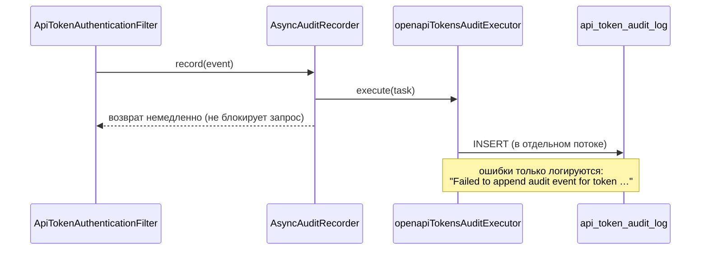

# Аудит и статистика

Библиотека ведёт журнал обращений по API-токенам и агрегированную статистику использования.
Это основа для расследований («какой токен и когда ходил в этот эндпоинт»), для отображения
активности в UI и для контроля «мёртвых» токенов.

## Что фиксируется

Событие аудита (`AuditEvent`) содержит:

| Поле | Тип | Описание |
|---|---|---|
| `tokenId` | `UUID` | Идентификатор токена (может отсутствовать, если токен не опознан) |
| `ownerId` | `String` | Владелец токена |
| `tenantId` | `String` | Тенант (может быть `null`) |
| `httpMethod` | `String` | `GET`, `POST`, … |
| `endpoint` | `String` | `request.getRequestURI()` — путь без query-строки |
| `action` | `String` | Пока всегда `AUTHENTICATE` |
| `success` | `boolean` | Результат аутентификации |
| `responseStatus` | `Integer` | 200 / 401 / 429 |
| `ip` | `String` | `request.getRemoteAddr()` — IP клиента (без учёта `X-Forwarded-For`) |
| `userAgent` | `String` | Заголовок `User-Agent` |
| `createdAt` | `Instant` | Момент события (UTC, из бина `Clock`) |

!!! warning "Аудит покрывает только аутентификацию"
    Событие пишется **только** в `ApiTokenAuthenticationFilter`, то есть при попытке
    аутентификации по Bearer-токену. **Не** попадают в аудит:

    - создание токена (`POST /api/openapi/tokens`);
    - отзыв (`DELETE .../tokens/{id}`);
    - блокировка / разблокировка администратором;
    - обращения, аутентифицированные иначе (сессия, HTTP Basic, Keycloak).

    Если требуется полноценный «кто выдал/отозвал токен», нужно добавить запись событий
    из своих сервисов (свой `AuditRecorder` или обёртка над `ApiTokenService`).

## Куда пишется

| Слой | Компонент | Поведение |
|---|---|---|
| Порт | `AuditRecorder#record(AuditEvent)` | Контракт записи |
| Реализация | `AsyncAuditRecorder` | Кладёт задачу в `Executor` и сразу возвращает управление |
| Исполнитель | бин `openapiTokensAuditExecutor` | `ThreadPoolTaskExecutor`, core 2 / max 4, префикс потоков `openapi-tokens-audit-` |
| Порт хранилища | `AuditLogRepository` | `append`, `findByTokenId`, `usageStats` |
| Реализация | `JpaAuditLogRepository` | Таблица `api_token_audit_log` |



!!! info "Асинхронность и надёжность"
    Запись аудита не влияет на обработку запроса: сбой вставки **никогда** не пробрасывается
    клиенту и не откатывает основную транзакцию — ошибка попадает только в лог уровня `ERROR`.
    Обратная сторона: события не теряются при остановке приложения (очередь executor'а
    не персистентна), и порядок записей не гарантирован.

    Аудит всегда асинхронный и всегда включён — см. предупреждение ниже.

## Настройки и «мёртвые» свойства

```yaml
openapi:
  tokens:
    audit:
      enabled: true          # объявлено, НЕ используется
      async: true            # объявлено, НЕ используется
      record-failures: true  # объявлено, НЕ используется
```

!!! danger "Свойства аудита не читаются кодом"
    Ни `audit.enabled`, ни `audit.async`, ни `audit.record-failures` не используются
    в автоконфигурации: бин `AuditRecorder` создаётся всегда и всегда как `AsyncAuditRecorder`.
    Практические следствия:

    - **отключить аудит через конфигурацию нельзя** — только заменив бин `AuditRecorder`
      своей реализацией (например, no-op);
    - отключить запись неуспешных попыток (`record-failures: false`) тоже нельзя;
    - сделать запись синхронной (`async: false`) нельзя.

Также нет TTL/ротации: таблица `api_token_audit_log` растёт неограниченно. Уборку старых
записей нужно организовать самостоятельно (партиционирование, cron-задача, `pg_cron`,
внешний архиватор). Индексы `(token_id, created_at)` и `(created_at)` созданы в миграции V1.

## Чтение аудита

### Через REST

| Endpoint | Кто | Лимит записей | Сортировка |
|---|---|---|---|
| `GET /api/openapi/tokens/{id}/audit` | владелец токена | 50 | `created_at DESC` |
| `GET /api/openapi/admin/tokens/{id}/audit` | `ROLE_ADMIN` | 100 | `created_at DESC` |

Пример ответа (JSON-представление доменного `AuditEvent`):

```json
[
  {
    "tokenId": "0f9a1b7c-1a2b-4c3d-8e4f-5a6b7c8d9e0f",
    "ownerId": "demo",
    "tenantId": null,
    "httpMethod": "GET",
    "endpoint": "/api/demo/payments",
    "action": "AUTHENTICATE",
    "success": true,
    "responseStatus": 200,
    "ip": "127.0.0.1",
    "userAgent": "curl/8.7.1",
    "createdAt": "2026-10-07T11:00:00Z"
  }
]
```

Постраничной навигации нет: эндпоинты всегда отдают «первые N» записей с начала
(`findByTokenId(id, 0, 50|100)`).

### Через Java

```java
@Autowired AuditLogRepository auditLogRepository;

List<AuditEvent> events = auditLogRepository.findByTokenId(tokenId, 0, 50);
TokenUsageStats stats   = auditLogRepository.usageStats(tokenId);
```

!!! bug "Пагинация в `findByTokenId` считается некорректно"
    Реализация переводит `offset`/`limit` в номер страницы целочисленным делением:

    ```java
    int page = limit <= 0 ? 0 : offset / limit;
    int size = limit <= 0 ? 20 : limit;
    ```

    - `offset`, не кратный `limit` (например, `offset=5, limit=10`), **молча игнорируется** —
      вернётся страница с `offset=0`;
    - при `limit <= 0` принудительно берётся `page=0, size=20`, `offset` тоже игнорируется;
    - общего количества записей (`total`) порт не возвращает.

    Для честной пагинации нужен либо `offset`, кратный `limit`, либо расширение порта
    `AuditLogRepository` (это изменение SPI).

## Статистика использования

`TokenUsageStats` (эндпоинт `GET /api/openapi/tokens/{id}/stats`):

```json
{
  "tokenId": "0f9a1b7c-1a2b-4c3d-8e4f-5a6b7c8d9e0f",
  "totalRequests": 128,
  "successfulRequests": 120,
  "failedRequests": 8,
  "lastUsedAt": "2026-10-07T11:00:00Z"
}
```

Как считаются значения (`JpaAuditLogRepository#usageStats`):

| Поле | Источник |
|---|---|
| `totalRequests` | `COUNT(*) WHERE token_id = ?` |
| `successfulRequests` | `COUNT(*) WHERE token_id = ? AND success = true` |
| `failedRequests` | `total - successful` |
| `lastUsedAt` | `created_at` **самой свежей записи** аудита (независимо от `success`) |

!!! note "Два разных `lastUsedAt`"
    | Где | Значение |
    |---|---|
    | `ApiTokenResponse.lastUsedAt` (карточки токена, список) | Поле `api_token.last_used_at`: обновляется **только при успешной** аутентификации (`touchLastUsed`) |
    | `TokenUsageStats.lastUsedAt` (эндпоинт `/stats`) | Время **последнего события** аудита, включая неуспешные попытки (401/429) |

    В интерфейсе эти значения могут расходиться: «последнее использование» в статистике
    покажет и неудачные попытки. При отображении стоит подписывать их по-разному.

Если `AuditLogRepository` в контексте отсутствует (например, персистентность отключена),
`DefaultApiTokenService#usageStats` возвращает нулевую статистику:
`TokenUsageStats(tokenId, 0, 0, 0, null)`.

## Отображение в UI (демо)

| Страница | Что показывает |
|---|---|
| `/ui/tokens/{id}` | Статистика + журнал аудита (50 записей) |
| `/admin/tokens/{id}` | Метаданные владельца, статистика, аудит (100 записей), блокировка/разблокировка/отзыв |

## Связанные разделы

- [Аутентификация](security.md) — когда именно формируется событие.
- [Rate limiting](rate-limiting.md) — отказы 429 в аудите.
- [Модель данных](../architecture/data-model.md) — таблица `api_token_audit_log`.
- [Ограничения и roadmap](../operations/roadmap.md) — отсутствие ротации журнала.
