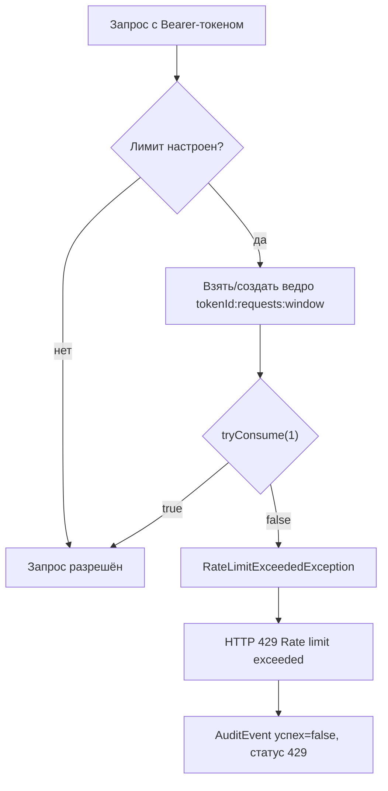

# Rate limiting

Каждый токен может иметь собственный лимит: «не более **N** запросов за **W** секунд».
Лимит задаётся при создании токена и применяется при каждой аутентификации по этому токену.

## Как задать лимит

```bash
curl -u demo:demo -H 'Content-Type: application/json' \
  -d '{
        "name": "ci-bot",
        "scopes": ["payments:read"],
        "rateLimitRequests": 100,
        "rateLimitWindowSeconds": 60
      }' \
  http://localhost:8080/api/openapi/tokens
```

| Поле запроса | Тип | Описание |
|---|---|---|
| `rateLimitRequests` | `Integer` | Число запросов в окне |
| `rateLimitWindowSeconds` | `Integer` | Длина окна в секундах |

Лимит считается **настроенным**, только если заданы **оба** поля
(`RateLimitPolicy#isConfigured()`). Если хотя бы одно отсутствует:

- `RateLimitPolicy.unlimited()` — лимит не применяется, запросы не ограничиваются;
- это же поведение по умолчанию, если поля не переданы в запросе.

Отдельного эндпоинта для изменения лимита у существующего токена нет: чтобы поменять лимит,
нужно отозвать токен и выпустить новый (или изменить строку в БД напрямую:
`rate_limit_requests`, `rate_limit_window_seconds`).

## Алгоритм

Реализация — `Bucket4jRateLimiter` на библиотеке **Bucket4j 8.14.0**, in-memory:

```java
Bandwidth limit = Bandwidth.builder()
        .capacity(policy.requests())
        .refillGreedy(policy.requests(), Duration.ofSeconds(policy.windowSeconds()))
        .build();
```

- **Ёмкость** = `requests` (максимальный «запас» токенов ведра).
- **Пополнение** — *greedy* (жадное): ведро пополняется непрерывно, со скоростью
  `requests / windowSeconds` в секунду, а не «пачкой» в начале окна. То есть при
  `100 запросов / 60 c` после всплеска восстанавливается примерно 1.67 запроса в секунду.
- Каждое обращение пытается израсходовать ровно 1 единицу (`tryConsume(1)`).
- Ведро создаётся один раз и живёт в `ConcurrentHashMap` с ключом
  `tokenId:requests:windowSeconds`.



## Поведение при превышении

| Что | Значение |
|---|---|
| HTTP-статус | **429 Too Many Requests** |
| Тело ответа | стандартная страница ошибки контейнера со сообщением `Rate limit exceeded` (формируется `response.sendError`, не JSON) |
| Заголовок `Retry-After` | **не отдаётся** |
| Заголовки остатка квоты (`X-RateLimit-*`) | **не отдаются** |
| Аудит | запись с `success = false`, `responseStatus = 429`, `action = "AUTHENTICATE"`, `tokenId` заполнен |
| Тип исключения | `RateLimitExceededException` (наследник `AuthenticationException`) с `tokenId` |

Так как `RateLimitExceededException` — это `AuthenticationException`, фильтр различает
его отдельной ветвью `catch` и отдаёт 429 вместо 401.

## Конфигурация

```yaml
openapi:
  tokens:
    rate-limit:
      backend: memory    # объявлено в свойствах, но НЕ используется
```

!!! warning "`rate-limit.backend` — мёртвая настройка"
    Свойство `openapi.tokens.rate-limit.backend` присутствует в `OpenApiTokensProperties`,
    однако нигде не читается: бин `RateLimiter` всегда создаётся как `Bucket4jRateLimiter`
    и всегда in-memory. Указание `redis` или любого другого значения ни на что не влияет.

Чтобы получить распределённый лимит, нужно зарегистрировать свой бин `RateLimiter`
(например, на Redis/Bucket4j-Redis, Hazelcast или через шлюз) — он подхватится
благодаря `@ConditionalOnMissingBean`. См. [Порты и SPI](../api/spi.md).

## Ограничения текущей реализации

| Ограничение | Следствие | Что делать |
|---|---|---|
| In-memory `ConcurrentHashMap` | В кластере из N узлов фактический лимит ≈ N × `requests` | Внешнее хранилище или лимит на уровне API-gateway |
| Ведра **никогда не удаляются** | Память растёт с числом токенов; после отзыва/удаления токена ведро остаётся в памяти процесса | Свой `RateLimiter` (например, с Caffeine и TTL) либо перезапуск инстанса |
| Ключ включает параметры политики | Изменение `requests`/`window` в БД создаёт **новое** ведро со свежей ёмкостью (обход лимита) | Не менять политику «на ходу»; учесть при прямых правках БД |
| Лимит только для `atk_`-токенов | Запросы по Basic/сессии/Keycloak этим механизмом не ограничиваются | Лимиты для остальных механизмов — средствами продукта |
| Нет «мягких» уведомлений | Клиент узнаёт о лимите только по 429 | Отдавать `X-RateLimit-*`/`Retry-After` в своём фильтре-обёртке |
| Нет глобального лимита | Ограничение всегда пер-токенное | Общий лимит — на уровне шлюза |

## Тестирование

Поведение покрыто модульными тестами `Bucket4jRateLimiterTest` (с подменяемым `TimeMeter`,
чтобы не зависеть от реального времени). Для интеграционной проверки удобно задать
«жёсткий» лимит и вызвать защищённый эндпоинт дважды:

```bash
TOKEN=$(curl -s -u demo:demo -H 'Content-Type: application/json' \
  -d '{"name":"rl","scopes":["payments:read"],"rateLimitRequests":1,"rateLimitWindowSeconds":3600}' \
  http://localhost:8080/api/openapi/tokens | jq -r .rawToken)

curl -s -o /dev/null -w '%{http_code}\n' -H "Authorization: Bearer $TOKEN" http://localhost:8080/api/demo/payments  # 200
curl -s -o /dev/null -w '%{http_code}\n' -H "Authorization: Bearer $TOKEN" http://localhost:8080/api/demo/payments  # 429
```

## Связанные разделы

- [Аутентификация](security.md) — место проверки лимита в цепочке.
- [Аудит](audit.md) — как фиксируются отказы по лимиту.
- [Порты и SPI](../api/spi.md) — свой `RateLimiter`.
