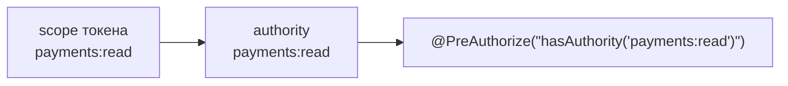
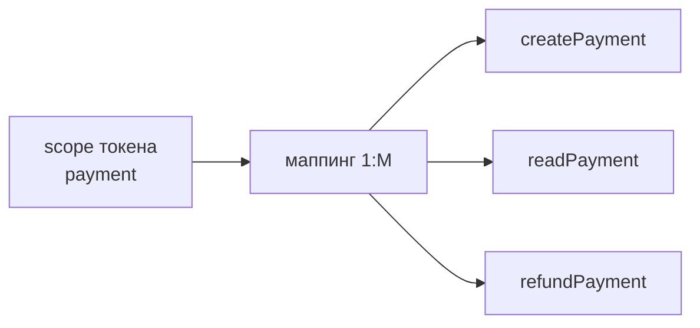

# Скоупы и права

Скоуп — это строка, которая ограничивает, что токену разрешено делать. Библиотека поддерживает
две модели преобразования скоупов токена в **права (authority) Spring Security**.

| Модель | Режим | Соответствие | Когда использовать |
|---|---|---|---|
| Прямая | `identity` | 1:1 — `scope` токена становится authority как есть | Приложение уже мыслит «скоупами API»; простой публичный API |
| Маппинг | `mapped` | 1:M — один скоуп токена разворачивается в набор authority | Внутренние права приложения отличаются от внешних скоупов; нужен слой совместимости |

```yaml
openapi:
  tokens:
    scopes:
      mode: identity   # identity | mapped
```

---

## Режим `identity` (по умолчанию)



`IdentityScopeResolver` возвращает тот же набор строк. Пример из демо-приложения:

```java
@GetMapping("/payments")
@PreAuthorize("hasAuthority('payments:read')")
public List<Payment> payments() { … }
```

Плюсы: нулевая конфигурация, понятная модель. Минусы: «внешние» имена скоупов становятся
именами прав в коде — переименование прав ломает уже выпущенные токены.

## Режим `mapped`



Скоупы токена разворачиваются через `ScopeMappingSource`:

```yaml
openapi:
  tokens:
    scopes:
      mode: mapped
      mappings:
        payment:
          - createPayment
          - readPayment
          - refundPayment
        report:
          - readReport
```

Если пользователь выпускает токен со скоупом `payment`, в security context попадут три
authority — и заработают привычные проверки:

```java
@PreAuthorize("hasAuthority('createPayment')")
```

### Приоритет источников маппингов

`CompositeMappingSource` объединяет конфигурацию и таблицу `scope_mapping`:

| Ситуация | Что применяется |
|---|---|
| В `scope_mapping` есть хотя бы одна строка для `tokenScope` | **Только строки из БД** (конфиг для этого скоупа игнорируется) |
| В БД строк нет | Значение из `openapi.tokens.scopes.mappings` |
| Нет ни в БД, ни в конфиге | Пустой набор authority → токен аутентифицируется, но не имеет прав |

!!! warning "Строка в БД полностью перекрывает конфиг"
    Достаточно одной записи в `scope_mapping` для скоупа `payment`, чтобы конфигурационные
    маппинги `payment` перестали применяться. Это удобно для «горячей» правки прав,
    но опасно при частичном заполнении таблицы — легко случайно сузить права.

### Тенантность маппингов

Запрос к `scope_mapping` (JPQL в `ScopeMappingJpaRepository`):

```sql
SELECT m FROM ScopeMappingEntity m
WHERE m.tokenScope IN :tokenScopes
  AND (m.tenantId IS NULL OR m.tenantId = :tenantId)
```

- строка с `tenant_id IS NULL` — общая для всех тенантов;
- строка с `tenant_id = 'tenant-a'` — только для тенанта `tenant-a`;
- тенант берётся из `ApiToken#tenantId`, который заполняется при создании токена.

Текущее ограничение: `DefaultScopeCatalog` вызывает `projectScopesFor(scope, null)`,
поэтому в справочнике скоупов для тенант-специфичных маппингов права **не отображаются**
(вернутся только глобальные).

---

## Справочник скоупов

`ScopeCatalog` — единая точка «какие скоупы существуют и что они значат». Это read-API для
UI создания токена, страницы документации и админ-консоли.

```java
@Autowired ScopeCatalog scopeCatalog;

List<ScopeInfo> scopes = scopeCatalog.listScopes();
// ScopeInfo(scope, description, projectScopes)
// → ScopeInfo("payment:read", "Чтение платежей", Set.of("readPayment"))
```

### Источники описаний и приоритет

| Приоритет | Источник | Где задаётся |
|---|---|---|
| 1 (высший) | Таблица `scope_catalog` | миграция `V2__scope_catalog.sql`, `scope` PK + `description` |
| 2 | Конфигурация | `openapi.tokens.scopes.catalog` |
| 3 | Маппинги | `ScopeMappingSource` — добавляют скоупы в список, даже если описания нет |

Итоговый список — **объединение** описанных скоупов и скоупов, известных из маппингов,
отсортированное по имени (`TreeSet`). Скоуп без описания возвращается с `description: null`;
скоуп без маппинга — с пустым `projectScopes`.

### Конфигурация: двоеточие в ключе

!!! danger "Ключи со `:` в YAML — только в квадратных скобках"
    ```yaml
    openapi:
      tokens:
        scopes:
          catalog:
            "[payments:read]": "Чтение платежей"   # ✅ правильно
            payments:read: "Чтение платежей"       # ❌ Spring потеряет ':' при биндинге Map<String,String>
    ```
    Без скобок Spring Boot отбрасывает часть ключа после `:` (он воспринимает её как разделитель),
    и в каталоге появляются «битые» скоупы вида `payments`. Это самая частая ошибка конфигурации.

### Доступ к справочнику

=== "REST"

    ```bash
    curl -u demo:demo http://localhost:8080/api/openapi/scopes
    ```

    ```json
    [
      {
        "scope": "payments:read",
        "description": "Чтение платежей — открывает GET /api/demo/payments",
        "projectScopes": []
      }
    ]
    ```

=== "Java"

    ```java
    @Autowired ScopeCatalog catalog;
    List<ScopeInfo> all = catalog.listScopes();
    ```

=== "UI (демо)"

    Страница `/ui/scopes`; описания также показываются подсказками в форме `/ui/tokens/new`.

---

## Валидация скоупов при создании токена

!!! danger "Скоупы из запроса не проверяются"
    `CreateTokenRequest.scopes` проверяется только на непустоту и непустые строки
    (`@NotEmpty Set<@NotBlank String>`). Библиотека **не сверяет** запрошенные скоупы
    ни со справочником, ни с правами владельца, ни с белым списком.

    Последствия:

    1. Владелец может выпустить токен с любым скоупом — в том числе с несуществующим
       (`"super:scope"`), что создаёт «мусорные» токены.
    2. В режиме `identity` любой аутентифицированный пользователь может выпустить токен
       со скоупом `ROLE_ADMIN` и получить доступ к административным эндпоинтам
       (`/api/openapi/admin/**` требует `hasRole("ADMIN")` → authority `ROLE_ADMIN`).
       Это **повышение привилегий**. Подробнее — в разделе
       [Аутентификация](security.md#повышение-привилегий-через-скоупы).

    **Как закрыть** (на стороне продукта, до выхода в продакшен):

    - ограничить набор допустимых скоупов: проверять `request.scopes()` против `ScopeCatalog`
      или собственного белого списка в своём контроллере-обёртке;
    - не выдавать пользователю права, которые он не имеет сам (например, пересекать
      запрошенные authority с authority текущего пользователя);
    - использовать режим `mapped`: тогда authority появляются только из объявленных маппингов,
      и произвольная строка в скоупе не даёт прав;
    - не подключать административные эндпоинты статера напрямую к внешнему контуру.

## Нормализация и регистр

- `ApiToken` при создании делает `trim()` каждого скоупа, удаляет пустые и дубликаты
  (`LinkedHashSet`), бросает `EmptyScopesException`, если набор пуст.
- Регистр **не** нормализуется: `payments:read` и `Payments:Read` — разные скоупы.
- Сравнение в БД (`IN`, `=`) чувствительно к регистру и пробелам, поэтому `tenant_id`/`scope`
  из внешних источников стоит тримить и приводить к единому регистру до записи.

## Связанные разделы

- [Аутентификация и авторизация](security.md) — как authority попадают в security context.
- [Порты и SPI](../api/spi.md) — как подменить `ScopeResolver` и `ScopeCatalog`.
- [Модель данных](../architecture/data-model.md) — таблицы `scope_mapping`, `scope_catalog`.
