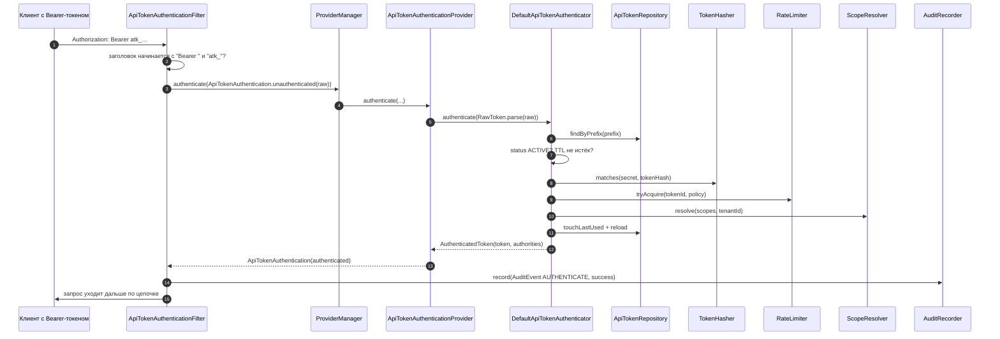

# Аутентификация и авторизация

Раздел описывает полный путь токена: формат, хеширование, фильтр Spring Security, режимы
определения владельца, проверку прав и известные риски.

## Формат токена

```
atk_<prefix>_<secret>
│   │        └── 64 hex-символа (32 случайных байта, SecureRandom)
│   └── публичный префикс, по умолчанию 8 hex-символов (4…16)
└── схема ("atk"), константа RawToken.SCHEME
```

Пример: `atk_9f3c1a7b_5d8e…c1` (полная длина секрета — 64 символа).

| Свойство | Значение | Где настроить |
|---|---|---|
| Схема | `atk` (зашита в код) | — |
| Длина префикса | 8, допустимо 4…16 | `openapi.tokens.token.prefix-length` |
| Длина секрета | 32 байта (64 hex) | зашита в `RawToken.DEFAULT_SECRET_BYTES` |
| Регулярное выражение | `^atk_([A-Za-z0-9]{4,16})_([A-Za-z0-9_-]+)$` | зашито в `RawToken.TOKEN_PATTERN` |
| Заголовок | `Authorization` | `openapi.tokens.token.header` |
| Префикс схемы | `Bearer ` (с пробелом) | `openapi.tokens.token.bearer-prefix` |

**Что хранится в БД:**

| Данные | Хранение |
|---|---|
| `prefix` | открытым текстом (`VARCHAR(16)`, уникальный индекс) |
| секрет | только хеш (`token_hash`, Argon2id по умолчанию) |
| сырой токен | **не хранится нигде** |

!!! info "Почему поиск идёт по префиксу"
    Хеш необратим, поэтому найти токен по секрету нельзя. Сначала по префиксу находится
    кандидат (уникальный индекс `uq_api_token_prefix` — быстрый поиск), затем проверяется
    хеш секрета. Префикс — публичная часть, он безопасен для логов и для отображения в UI
    (`prefix` возвращается в API).

## Хеширование секрета

| Алгоритм | Класс | Параметры | Когда выбирать |
|---|---|---|---|
| **Argon2id** (по умолчанию) | `Argon2TokenHasher` | iterations = 3, memory = 64 МиБ, parallelism = 1 | Рекомендуется: устойчив к GPU/ASIC-перебору |
| BCrypt | `BcryptTokenHasher` | cost = 12 | Если Argon2 недоступен в окружении (нативный код, ограничения JVM) |

```yaml
openapi:
  tokens:
    hashing:
      algorithm: argon2   # argon2 | bcrypt
```

!!! warning "Стоимость Argon2 в горячем пути"
    Параметры (3 итерации, 64 МиБ памяти) подобраны для **редких** операций. Хеш проверяется
    при каждом запросе с Bearer-токеном, поэтому под высокой нагрузкой (тысячи RPS)
    CPU и память станут узким местом. Варианты: кешировать результат аутентификации,
    снизить параметры своим бином `TokenHasher` или перейти на BCrypt.
    Алгоритм нельзя менять «на лету»: хеши, созданные другим алгоритмом, перестанут проверяться.

Хеш-строка имеет формат, специфичный для библиотеки-провайдера (Argon2 — `$argon2id$v=19$…`,
BCrypt — `$2a$12$…`), и хранится в `VARCHAR(255)`.

---

## Путь запроса через Spring Security



Особенности реализации, которые важно знать:

- **Фильтр не является точкой входа (`AuthenticationEntryPoint`)** — он только пытается
  аутентифицировать запрос и, если Bearer-токена нет или он не в формате `atk_`, просто
  пропускает запрос дальше, давая шанс другим механизмам (Basic, сессия, Keycloak).
- При ошибке аутентификации фильтр сам пишет ответ: **401** с телом `Unauthorized`;
  при превышении лимита — **429** с телом `Rate limit exceeded`. Ответ формируется
  через `response.sendError`, поэтому тело — стандартная страница ошибки контейнера.
- **Локальный `AuthenticationManager`**: комментарий в автоконфигурации поясняет, что
  `ApiTokenAuthenticationProvider` не регистрируется как бин специально, чтобы не подменить
  глобальный `DaoAuthenticationProvider` и не сломать form-login/httpBasic. Провайдер живёт
  внутри `ProviderManager`, созданного только для фильтра.
- Аутентификация проходит **только** если заголовок начинается с `Bearer ` (значение
  `bearer-prefix`) и сырое значение начинается с `atk_`.

### Что происходит с `Authentication`

`ApiTokenAuthentication` — наследник `AbstractAuthenticationToken`:

| Метод | Значение |
|---|---|
| `getPrincipal()` | доменный объект `ApiToken` |
| `getCredentials()` | сырой токен (только до аутентификации) |
| `getAuthorities()` | authority, полученные из скоупов через `ScopeResolver` |
| `getApiToken()` | тот же `ApiToken` — удобно для доступа в контроллерах |

---

## Режимы определения владельца

Владелец нужен, чтобы отделять токены разных пользователей и считать квоты.

```yaml
openapi:
  tokens:
    auth:
      mode: internal   # internal | keycloak
```

### `internal` (по умолчанию)

`InternalTokenOwnerResolver` — по порядку:

1. если аутентификация — `ApiTokenAuthentication`, владелец берётся из самого токена
   (`ownerId`, `tenantId`) — это позволяет управлять токенами, используя другой токен;
2. `UserDetails#getUsername()` в качестве `ownerId`;
3. `String`-principal;
4. `Authentication#getName()`.

`tenantId` в этом режиме всегда `null` (кроме случая с `ApiTokenAuthentication`).

### `keycloak`

`KeycloakTokenOwnerResolver` поддерживает три контекста:

| Контекст | Источник `ownerId` | Источник `tenantId` |
|---|---|---|
| `JwtAuthenticationToken` (resource server, access token) | claim `sub` | claim `tenant_id` (настраивается) |
| `OidcUser` (oauth2Login, authorization code flow) | `getSubject()` | claim `tenant_id` |
| `ApiTokenAuthentication` | `token.ownerId()` | `token.tenantId()` |

```yaml
openapi:
  tokens:
    auth:
      mode: keycloak
      keycloak:
        tenant-claim: tenant_id   # имя claim с идентификатором тенанта
```

Отсутствие `sub` → `IllegalStateException("JWT subject (sub) is missing")`.
Неподдерживаемый тип аутентификации → `IllegalStateException` с описанием фактического
principal. Режим `keycloak` требует наличия `spring-security-oauth2-resource-server`
на classpath (в автоконфигурации стоит `@ConditionalOnClass`): иначе бин владельца не создастся
и приложение не поднимется с понятной ошибкой отсутствия `TokenOwnerResolver`.

!!! danger "В режиме `keycloak` готовую цепочку статера нужно заменить"
    Она умеет только HTTP Basic и не принимает JWT. Объявите свой бин
    `openapiTokensSecurityFilterChain` с `oauth2ResourceServer().jwt()` и добавьте в него
    `ApiTokenAuthenticationFilter`, иначе `atk_…` перестанут работать. Также нужен маппинг
    ролей Keycloak в `ROLE_*` — иначе не сработают `hasRole("ADMIN")` и админский UI.

    Готовый разбор с кодом, realm-конфигурацией и тремя цепочками безопасности —
    [Keycloak: интеграция](../guides/keycloak.md).

!!! note "Тенант из запроса не проверяется"
    При создании токена `tenantId` берётся из запроса, если он там есть
    (`command.tenantId() != null ? command.tenantId() : owner.tenantId()`), без сверки
    с тенантом владельца. В мультитенантном контуре это позволяет записать токен
    «в чужой тенант». Закройте это на уровне продукта: убирайте поле из запроса или
    перезаписывайте его значением из security context.

---

## Готовый `SecurityFilterChain`

Статер регистрирует собственную цепочку для `/api/openapi/**` (бин
`openapiTokensSecurityFilterChain`, `@Order(1)`, создаётся только если такого бина ещё нет):

| Настройка | Значение |
|---|---|
| `securityMatcher` | `/api/openapi/**` |
| CSRF | **отключён** |
| `/api/openapi/admin/**` | требуется роль `ADMIN` (authority `ROLE_ADMIN`) |
| остальные `/api/openapi/**` | `authenticated()` |
| HTTP Basic | включён |
| Фильтр токенов | добавляется перед `UsernamePasswordAuthenticationFilter` |

Чтобы полностью контролировать правила, объявите свой бин с именем
`openapiTokensSecurityFilterChain` (или исключите автоконфигурацию) — тогда правила статера
не применятся. Подробнее: [Бэкенд-разработчику](../guides/backend.md).

---

## Авторизация в коде продукта

Скоупы токена превращаются в authority, поэтому работают стандартные механизмы Spring Security:

```java
@Configuration
@EnableMethodSecurity
class MethodSecurityConfig { }

@RestController
class PaymentsController {

    @GetMapping("/api/demo/payments")
    @PreAuthorize("hasAuthority('payments:read')")     // identity-режим
    public List<Payment> payments() { … }

    @PostMapping("/api/payments")
    @PreAuthorize("hasAuthority('createPayment')")     // mapped-режим
    public Payment create(@RequestBody PaymentRequest request) { … }
}
```

### Программные проверки

```java
@Autowired ApiTokenPermissionChecker checker;

if (checker.hasAuthority("readPayment")) { … }
checker.hasAnyAuthority("createPayment", "refundPayment");
```

`ApiTokenPermissionEvaluator` реализует и `PermissionEvaluator`, и `ApiTokenPermissionChecker`,
но регистрируется в контексте **как `ApiTokenPermissionChecker`**
(`@Bean ApiTokenPermissionChecker apiTokenPermissionChecker()`). Поэтому выражения
`hasPermission(...)` в `@PreAuthorize` **не заработают** без дополнительной настройки:
чтобы использовать `PermissionEvaluator`, зарегистрируйте его самостоятельно как бин
`PermissionEvaluator` и свяжите с `MethodSecurityExpressionHandler`.

---

## Повышение привилегий через скоупы

!!! danger "Критично: произвольные скоупы при создании токена"
    Эндпоинт создания токена (`POST /api/openapi/tokens`) принимает **любые** непустые
    строки в `scopes` и не сверяет их ни со справочником, ни с правами владельца.
    В режиме `scopes.mode=identity` скоуп становится authority без изменений.

    **Сценарий атаки:**

    1. любой аутентифицированный пользователь (например, `demo`/`demo` из демо-приложения)
       вызывает `POST /api/openapi/tokens` с `{"name":"x","scopes":["ROLE_ADMIN"]}`;
    2. получает `rawToken`;
    3. обращается с этим токеном к `GET /api/openapi/admin/tokens` — цепочка статера
       требует `hasRole("ADMIN")` → authority `ROLE_ADMIN` → **доступ разрешён**;
    4. видит и блокирует/отзывает токены всех владельцев.

    **Рекомендации по устранению (на стороне продукта):**

    - валидировать `scopes` входящего запроса по белому списку из `ScopeCatalog`
      или собственного перечня (свой контроллер-обёртка либо `HandlerInterceptor`/`@ControllerAdvice`);
    - запретить выдачу authority, которых у текущего пользователя нет;
    - использовать `scopes.mode=mapped` — тогда authority появляются только из объявленных
      маппингов, а произвольная строка не даёт прав;
    - ограничить административные эндпоинты статера отдельным контуром/ролью, недоступной
      обычным пользователям;
    - заменить готовый `SecurityFilterChain` статера своей конфигурацией.

    Подробнее об ограничениях — [Ограничения и roadmap](../operations/roadmap.md).

---

## Аудит аутентификации

Каждая попытка аутентификации по токену (успешная и неуспешная) записывается в аудит
с действием `AUTHENTICATE`:

| Результат | `success` | `responseStatus` | Комментарий |
|---|---|---|---|
| Успех | `true` | 200 | запись фиксируется **до** выполнения обработчика, поэтому фактический статус ответа может отличаться |
| Неверный токен/статус/TTL | `false` | 401 | `tokenId` в записи отсутствует — токен не идентифицирован |
| Превышен rate limit | `false` | 429 | `tokenId` присутствует (токен опознан) |

Подробнее: [Аудит и статистика](audit.md).

## Связанные разделы

- [Rate limiting](rate-limiting.md) — политика лимитов на токен.
- [Скоупы и права](scopes.md) — модели `identity` / `mapped`.
- [Бэкенд-разработчику](../guides/backend.md) — интеграция и своя конфигурация безопасности.
- [Порты и SPI](../api/spi.md) — замена `TokenOwnerResolver`, `TokenHasher`, `ApiTokenAuthenticator`.
