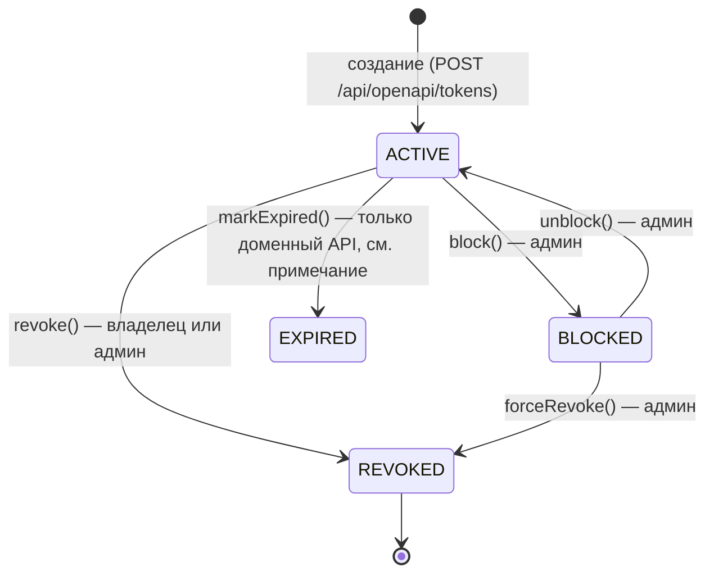
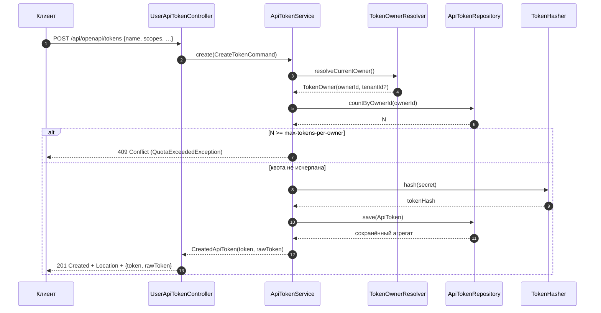

# Жизненный цикл токена

Раздел описывает, как токен создаётся, живёт, перестаёт работать и отзывается: статусы,
правила переходов, сроки жизни (TTL), квоты и что именно проверяется на каждом запросе.

## Статусы токена



| Статус | Значение | Можно аутентифицироваться | Кто переводит |
|---|---|---|---|
| `ACTIVE` | Токен работает | ✅ да (если не истёк TTL) | создание; разблокировка |
| `BLOCKED` | Временно отключён администратором, обратим | ❌ нет | админ: `block` |
| `REVOKED` | Отозван навсегда, необратимо | ❌ нет | владелец: `revoke`; админ: `forceRevoke` |
| `EXPIRED` | Истёк по сроку | ❌ нет | **см. примечание ниже** |

!!! warning "Статус `EXPIRED` в продакшене не выставляется"
    Метод `ApiToken#markExpired()` есть в доменной модели, но в production-коде его
    **никто не вызывает** (используется только в тестовых фикстурах демо-UI).
    Просроченный токен остаётся в БД со статусом `ACTIVE`, но **не проходит аутентификацию**,
    потому что TTL проверяется на каждом запросе в `DefaultApiTokenAuthenticator`.
    Практические следствия:

    - в списках токенов запись выглядит как `ACTIVE`, хотя фактически не работает;
    - UI/отчёты не могут отличить «живой» токен от просроченного по полю `status` —
      нужно сравнивать `expiresAt` / `lastUsedAt + slidingTtlSeconds` с текущим временем;
    - фонового задания, которое «убирает» просроченные токены, в библиотеке нет.

## Правила переходов

Переходы защищены инвариантами в домене (`ApiToken`), нарушение даёт `InvalidTokenStateException`
(HTTP 400 через `ApiTokenExceptionHandler`):

| Операция | Разрешена из статуса | Сообщение об ошибке |
|---|---|---|
| `revoke()` | любой, кроме `REVOKED` | `Token already revoked` |
| `block()` | только `ACTIVE` | `Only ACTIVE tokens can be blocked` |
| `unblock()` | только `BLOCKED` | `Only BLOCKED tokens can be unblocked` |
| `touchLastUsed()` | только `ACTIVE` (`isUsable()`) | `Cannot touch non-active token` |

!!! note "Повторный отзыв"
    `revoke()` для уже отозванного токена бросает исключение → повторный
    `DELETE /api/openapi/tokens/{id}` вернёт **400**, а не идемпотентный 204.
    Идемпотентность `DELETE` не обеспечена — это осознанное поведение текущей версии.

## Создание токена

Последовательность:



Что происходит по шагам:

1. **Владелец** определяется через `TokenOwnerResolver` из текущего security context
   (`ownerId`, при наличии — `tenantId`).
2. **Проверка квоты**: `countByOwnerId(ownerId) >= max-tokens-per-owner` → `QuotaExceededException`
   → HTTP **409 Conflict**.
3. **Генерация секрета**: `RawToken.generate(prefixLength)` — префикс из `prefixLength`
   hex-символов (по умолчанию 8) и секрет из 32 случайных байт (`SecureRandom`), закодированный
   в hex (64 символа).
4. **Хеширование**: `TokenHasher#hash(secret)`; в БД попадает только хеш.
5. **Сборка агрегата**: `scopes` нормализуются (trim, дубликаты убираются, пустой набор запрещён),
   `createdBy = ownerId`, `createdAt = now`, статус по умолчанию `ACTIVE`, `tenantId` — из команды,
   иначе из владельца.
6. **Сохранение** и возврат пары «агрегат + сырой токен».

Ответ содержит `rawToken` — **единственный** момент, когда секрет доступен в открытом виде.

### Квота: важная деталь

`countByOwnerId` считает **все** токены владельца независимо от статуса: `ACTIVE`, `BLOCKED`,
`REVOKED` и (гипотетически) `EXPIRED`. Поэтому:

- отозванные токены продолжают занимать квоту;
- чтобы выпустить новый токен «взамен» отозванного, квоту нужно поднять
  (`openapi.tokens.limits.max-tokens-per-owner`) или удалить строки из БД
  (в библиотеке нет операции удаления токена — есть только `deleteById` в порте
  `ApiTokenRepository`, который нигде не вызывается из production-кода).

## Сроки жизни (TTL)

Поддерживаются три режима, задаваемые при создании (`TokenExpiry`):

| Режим | Поля запроса | Поведение |
|---|---|---|
| **Бессрочный** | `expiresAt` не задан, `slidingTtlSeconds` не задан | `TokenExpiry.none()`; токен действует, пока `ACTIVE` |
| **Абсолютный** | `expiresAt = 2026-01-01T00:00:00Z` | Токен недействителен, начиная с `expiresAt` (проверка `!now.isBefore(expiresAt)`) |
| **Скользящий** | `slidingTtlSeconds = 3600` | Недействителен, если с момента последнего успешного использования прошло больше указанного интервала |
| **Комбинированный** | оба поля | Срабатывает то ограничение, которое наступит раньше |

```mermaid
gantt
    title Скользящий TTL (3600 c) продлевается при обращениях
    dateFormat X
    axisFormat %s
    section Токен
    создан           :0, 1
    обращение        :1, 1
    обращение        :2, 1
    окно после посл. :3, 4
```



Логика проверки (`TokenExpiry#isExpired(Clock)`):

- если задан `expiresAt` и `now >= expiresAt` → **просрочен**;
- если задан `slidingTtl`: «якорь» = `lastUsedAt`, а если его нет — `createdAt`;
  просрочен, если `now >= anchor + slidingTtl`;
- иначе не просрочен.

Скользящее окно продлевается вызовом `touchLastUsed` при **каждой успешной**
аутентификации — до проверки прав и выполнения запроса.

!!! tip "Значение по умолчанию"
    `openapi.tokens.token.default-ttl` (по умолчанию `90d`) объявлено в свойствах, но
    **не применяется** при создании токена: `DefaultApiTokenService` использует только
    `command.expiresAt()` и `command.slidingTtl()`. Если нужен TTL по умолчанию, его должен
    подставлять вызывающий код (например, ваш контроллер-обёртка или UI).

## Проверка токена при обращении

Порядок проверок в `DefaultApiTokenAuthenticator#authenticate` (важен для диагностики):

| # | Проверка | Результат при неудаче |
|---|---|---|
| 1 | Формат `atk_<prefix>_<secret>` | 401 `Unauthorized` |
| 2 | Поиск по `prefix` в БД | 401 |
| 3 | `status == ACTIVE` | 401 |
| 4 | `!expiry.isExpired(clock)` | 401 |
| 5 | `TokenHasher#matches(secret, tokenHash)` | 401 |
| 6 | Rate limit (`tryAcquire`) | **429** `Rate limit exceeded` |
| 7 | Разрешение скоупов в authority (`ScopeResolver`) | — (пустой набор authority) |
| 8 | `touchLastUsed` (продление скользящего окна) | — |
| 9 | Перечитывание токена и возврат `AuthenticatedToken` | — |

Все неуспешные исходы (кроме 429) отдают **401 без детализации** — нельзя определить,
существовал ли токен вообще. Это сделано намеренно, чтобы не давать информации атакующему.

## Использование токена владельцем

```bash
curl -H "Authorization: Bearer atk_abcd1234_<secret>" \
     http://localhost:8080/api/demo/payments
```

Владелец токена может управлять своими токенами теми же эндпоинтами
(`/api/openapi/tokens`), аутентифицируясь **любым** способом, который поддерживает приложение
(сессия, HTTP Basic, Keycloak, другой API-токен).

## Просмотр и статистика

| Что | Endpoint |
|---|---|
| Список своих токенов | `GET /api/openapi/tokens` |
| Карточка своего токена | `GET /api/openapi/tokens/{id}` |
| Статистика использования | `GET /api/openapi/tokens/{id}/stats` |
| Журнал аудита (50 записей) | `GET /api/openapi/tokens/{id}/audit` |
| Все токены (админ) | `GET /api/openapi/admin/tokens` |
| Любой токен (админ) | `GET /api/openapi/admin/tokens/{id}` |
| Аудит любого токена (100 записей) | `GET /api/openapi/admin/tokens/{id}/audit` |

Доступ к «своим» токенам ограничен владельцем: обращение к чужому токену возвращает
**404 Not Found** (а не 403) — существование чужого токена не раскрывается
(`DefaultApiTokenService#requireOwnedToken`).

## Удаление токенов

Операции физического удаления в API нет. `revoke` — это смена статуса, строка остаётся в БД
вместе с историей аудита. Порт `ApiTokenRepository#deleteById` существует, но production-код
его не вызывает; при прямом удалении строки сработает `ON DELETE CASCADE` для таблицы
`api_token_scope`, а записи в `api_token_audit_log` останутся (внешнего ключа там нет).

## Связанные разделы

- [Скоупы и права](scopes.md) — что именно разрешает токен.
- [Аутентификация](security.md) — как токен превращается в `Authentication`.
- [Rate limiting](rate-limiting.md) — политика «N запросов за окно».
- [Аудит](audit.md) — журнал и статистика.
- [Модель данных](../architecture/data-model.md) — как всё это хранится.
