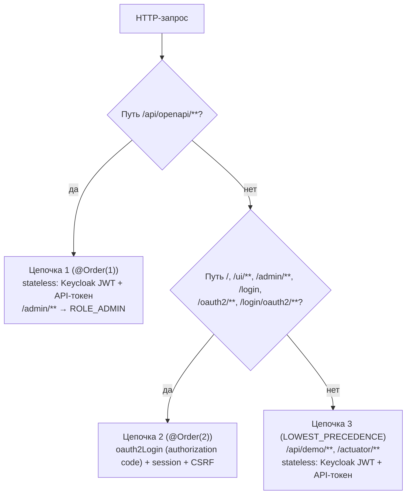

# Keycloak: интеграция

Раздел описывает работу библиотеки в режиме `openapi.tokens.auth.mode=keycloak` — на примере
готового модуля `openapi-tokens-sample-keycloak`, который поднимает Keycloak, входит в UI по
authorization code flow и принимает на API **два** типа учётных данных: Keycloak access token
и API-токен, выпущенный библиотекой.

!!! info "Зачем отдельный режим"
    В режиме `internal` владелец токена — пользователь, залогиненный в самом приложении
    (`UserDetails`). В режиме `keycloak` владелец — субъект Keycloak: `ownerId = claim sub`,
    а тенант — настраиваемый claim (`tenant_id` по умолчанию). Продукту не нужно дублировать
    пользователей: токены привязываются к пользователям Keycloak.

---

## 1. Что даёт готовый пример

| Файл | Назначение |
|---|---|
| `KeycloakSampleApplication` | Точка входа; сканирует `ru.openapi.tokens.sample.keycloak` и общий UI `ru.openapi.tokens.sample.ui` |
| `KeycloakSecurityConfig` | Три цепочки: `/api/openapi/**`, UI (OIDC login), `/api/demo/**` |
| `KeycloakJwtAuthenticationConverter` | Keycloak access token → authorities (`scope` + `ROLE_*` из ролей) |
| `KeycloakGrantedAuthoritiesMapper` | Роли Keycloak → `ROLE_*` для интерактивного входа (OIDC) |
| `KeycloakRoles` | Извлечение ролей из `realm_access.roles` и `resource_access.<client>.roles` |
| `KeycloakDemoController` | `/api/demo/whoami`, `/api/demo/payments` (скоуп токена), `/api/demo/reports` (роль Keycloak) |
| `docker/keycloak/realm-openapi-tokens.json` | Импорт realm: клиенты, роли, пользователи, client scopes |
| `src/main/resources/application.yml` | Настройка `oauth2Client` + `resourceserver.jwt` + `openapi.tokens.auth.mode=keycloak` |

---

## 2. Запуск примера

```bash
# PostgreSQL для keycloak-семпла (порт 5433) + Keycloak (порт 8180) с импортом realm
docker compose --profile keycloak up -d

./gradlew :openapi-tokens-sample-keycloak:bootRun
```

| Компонент | Адрес | Учётные данные |
|---|---|---|
| Приложение | <http://localhost:8081> | вход через Keycloak |
| Keycloak Admin Console | <http://localhost:8180> | `admin` / `admin` |
| Пользователи realm | — | `demo`/`demo` (роль `USER`), `admin`/`admin` (роли `ADMIN`, `USER`) |
| PostgreSQL | `localhost:5433/openapi_tokens_keycloak` | `openapi` / `openapi` |

!!! note "Отдельная БД и порт"
    Keycloak-семпл использует БД `openapi_tokens_keycloak` на порту **5433** и порт приложения
    **8081**, чтобы не конфликтовать с form-login семплом (5432/8080). Токены двух примеров
    не смешиваются.

### Проверка сценариев

```bash
# 1. Access token Keycloak (direct access grants, клиент openapi-tokens-api)
KJWT=$(curl -s -X POST \
  http://localhost:8180/realms/openapi-tokens/protocol/openid-connect/token \
  -d grant_type=password -d client_id=openapi-tokens-api -d client_secret=api-secret \
  -d username=demo -d password=demo | jq -r .access_token)

# 2. кто я — sub / tenant / authorities
curl -H "Authorization: Bearer $KJWT" http://localhost:8081/api/demo/whoami

# 3. выпустить API-токен от имени пользователя Keycloak (ownerId = sub)
curl -H "Authorization: Bearer $KJWT" -H 'Content-Type: application/json' \
  -d '{"name":"ci","scopes":["payments:read"]}' \
  http://localhost:8081/api/openapi/tokens

# 4. вызвать защищённый ресурс API-токеном (нужен скоуп payments:read)
curl -H "Authorization: Bearer atk_…" http://localhost:8081/api/demo/payments

# 5. ресурс, требующий роли Keycloak ADMIN (нужен вход admin-пользователем)
curl -H "Authorization: Bearer $ADMIN_JWT" http://localhost:8081/api/demo/reports
```

!!! warning "`/api/demo/payments` намеренно недоступен по Keycloak-токену"
    Эндпоинт требует authority `payments:read`, то есть **скоуп API-токена**. Keycloak access
    token такую authority не даёт — в этом и смысл сервиса токенов: долгоживущий доступ выдаётся
    отдельным отзываемым токеном, а не SSO-сессией.

---

## 3. Три цепочки безопасности



| # | Бин | Область | Что принимает |
|---|---|---|---|
| 1 | `openapiTokensSecurityFilterChain` (переопределён в примере) | `/api/openapi/**` | Keycloak access token **и** API-токен (`atk_…`); `/admin/**` → `ROLE_ADMIN` |
| 2 | `keycloakUiSecurityFilterChain` (`@Order(TokenUiSecurity.UI_FILTER_CHAIN_ORDER)`) | UI-пути + `/oauth2/**`, `/login/oauth2/**` | сессия после входа через Keycloak; CSRF включён |
| 3 | `demoApiSecurityFilterChain` (низший приоритет) | `/api/demo/**`, `/actuator/**` | те же два типа токенов; `/actuator/health` публичный |

### Ключевой момент: замена цепочки статера

!!! danger "Цепочка статера по умолчанию знает только HTTP Basic"
    Готовая цепочка `openapiTokensSecurityFilterChain` из авто-конфигурации настраивает
    HTTP Basic и фильтр API-токенов, но **не** resource server для JWT. В режиме `keycloak`
    её нужно заменить своим бином **с тем же именем**:

    ```java
    @Bean
    @Order(1)
    SecurityFilterChain openapiTokensSecurityFilterChain(
            HttpSecurity http,
            ApiTokenAuthenticationFilter apiTokenAuthenticationFilter,
            Converter<Jwt, ? extends AbstractAuthenticationToken> keycloakJwtAuthenticationConverter
    ) throws Exception {
        return http
                .csrf(csrf -> csrf.disable())
                .sessionManagement(session -> session.sessionCreationPolicy(SessionCreationPolicy.STATELESS))
                .oauth2ResourceServer(rs -> rs.jwt(jwt ->
                        jwt.jwtAuthenticationConverter(keycloakJwtAuthenticationConverter)))
                .securityMatcher("/api/openapi/**")
                .authorizeHttpRequests(auth -> auth
                        .requestMatchers("/api/openapi/admin/**").hasRole("ADMIN")
                        .anyRequest().authenticated())
                .addFilterBefore(apiTokenAuthenticationFilter, UsernamePasswordAuthenticationFilter.class)
                .build();
    }
    ```

    `ApiTokenAuthenticationFilter` добавляется вручную — тогда ключи `atk_…` продолжают работать
    наравне с Keycloak-токенами. Бин с тем же именем перекрывает автоконфигурацию
    (`@ConditionalOnMissingBean(name = "openapiTokensSecurityFilterChain")`).

---

## 4. Роли Keycloak → authorities

Keycloak кладёт роли в `realm_access.roles` (роли realm) и `resource_access.<client-id>.roles`
(роли клиента). Spring Security ожидает authority с префиксом `ROLE_`, поэтому нужен маппинг —
иначе `/admin/**` и `@PreAuthorize("hasRole('ADMIN')")` не сработают.

Класс `KeycloakRoles` собирает роли из обоих мест и добавляет префикс `ROLE_`
(`ADMIN` → `ROLE_ADMIN`).

| Тип аутентификации | Компонент | Что делает |
|---|---|---|
| Access token (REST) | `KeycloakJwtAuthenticationConverter` | claim `scope` → обычные authority (`payments:read`); роли → `ROLE_*`; principal = `preferred_username` (fallback `sub`) |
| Интерактивный вход (UI) | `KeycloakGrantedAuthoritiesMapper` | добавляет `ROLE_*` из атрибутов `OidcUserAuthority` (claims ID-токена + userinfo) |

!!! warning "Роли должны попадать в токен или userinfo"
    `KeycloakGrantedAuthoritiesMapper` читает роли из claims, доступных OIDC-клиенту. В примере
    за это отвечает client scope **`roles-to-token`** (`oidc-usermodel-realm-role-mapper`
    → claim `realm_access.roles`, включён в ID token, access token и userinfo) — он назначен
    клиенту `openapi-tokens-ui`. Если роли не попали в ID-токен/userinfo, `/admin/**` вернёт 403.

---

## 5. Realm-конфигурация примера

| Сущность | Значение |
|---|---|
| Realm | `openapi-tokens` |
| Роли | `USER`, `ADMIN` |
| Пользователи | `demo`/`demo` (`USER`), `admin`/`admin` (`ADMIN`, `USER`) |
| Клиент для API (`direct access grants`) | `openapi-tokens-api`, confidential, secret `api-secret` |
| Клиент для UI (authorization code) | `openapi-tokens-ui`, confidential, secret `ui-secret`, redirect `http://localhost:8081/*` |
| Client scope тенанта | `tenant` → hardcoded claim `tenant_id = tenant-a` (ID token, access token, userinfo) |
| Client scope ролей | `roles-to-token` → `realm_access.roles` |
| Issuer | `http://localhost:8180/realms/openapi-tokens` (переопределяется `KEYCLOAK_ISSUER_URI`) |

Конфигурация приложения:

```yaml
server:
  port: 8081

spring:
  security:
    oauth2:
      client:
        provider:
          keycloak:
            issuer-uri: ${KEYCLOAK_ISSUER_URI:http://localhost:8180/realms/openapi-tokens}
        registration:
          keycloak:
            provider: keycloak
            client-id: openapi-tokens-ui
            client-secret: ui-secret
            authorization-grant-type: authorization_code
            scope: [openid, profile, email]
      resourceserver:
        jwt:
          issuer-uri: ${KEYCLOAK_ISSUER_URI:http://localhost:8180/realms/openapi-tokens}

openapi:
  tokens:
    auth:
      mode: keycloak
      keycloak:
        tenant-claim: tenant_id
```

!!! note "Секреты — только для локального примера"
    `ui-secret` и `api-secret` лежат в realm-export и в `application.yml` исключительно как
    демонстрационные. В продукте секреты должны приходить из переменных окружения/Vault,
    а не из репозитория.

---

## 6. Поддержка контекстов в резолвере владельца

`KeycloakTokenOwnerResolver` понимает три ситуации:

| Контекст | `ownerId` | `tenantId` |
|---|---|---|
| `JwtAuthenticationToken` (resource server, access token) | `sub` | claim `tenant_id` |
| `OidcUser` (интерактивный вход, `oauth2Login`) | `sub` | claim `tenant_id` |
| `ApiTokenAuthentication` (запрос уже аутентифицирован API-токеном) | `token.ownerId()` | `token.tenantId()` |

Благодаря третьей строке API-токеном можно управлять своими токенами: владелец берётся
из самого токена, а не из SSO-сессии.

Ошибки: отсутствие `sub` → `IllegalStateException("JWT subject (sub) is missing")`;
неподдерживаемый тип аутентификации → `IllegalStateException` с описанием фактического principal.

---

## 7. Что нужно сделать продукту (чек-лист)

- [ ] Добавить `spring-boot-starter-oauth2-resource-server` (для API) и, если нужен вход
      в UI, `spring-boot-starter-oauth2-client`.
- [ ] Настроить `spring.security.oauth2.resourceserver.jwt.issuer-uri` и (для UI)
      `spring.security.oauth2.client.registration.*`.
- [ ] Установить `openapi.tokens.auth.mode=keycloak` и при необходимости
      `auth.keycloak.tenant-claim`.
- [ ] **Заменить** бин `openapiTokensSecurityFilterChain` цепочкой с
      `oauth2ResourceServer().jwt()`, добавив в неё `ApiTokenAuthenticationFilter`.
- [ ] Реализовать маппинг ролей Keycloak в `ROLE_*` для JWT и для OIDC-логина — иначе не
      работают `hasRole(...)` и админский UI.
- [ ] Убедиться, что роли попадают в ID-токен/userinfo (client scope с realm-role mapper).
- [ ] Проверить, что claim тенанта есть в токене (или задать свой `tenant-claim`).
- [ ] Настроить RP-initiated logout (`OidcClientInitiatedLogoutSuccessHandler`), иначе выход
      из приложения не закрывает SSO-сессию Keycloak.
- [ ] Вынести `client-secret` из репозитория в защищённое хранилище.
- [ ] Помнить про ограничение: `tenantId` при создании токена принимается из запроса
      без сверки с тенантом владельца (см. [Ограничения](../operations/roadmap.md)).

---

## 8. Тесты примера

| Тест | Тестов | Что проверяет |
|---|---|---|
| `KeycloakApiSecurityTest` | 8 | Keycloak JWT (мок `jwt()`-постпроцессором) → владелец из `sub`, роли → authority, доступ по скоупу API-токена, `/admin/**` только для `ADMIN` |
| `KeycloakUiSecurityTest` | 5 | Редирект на Keycloak при отсутствии сессии, доступ к `/admin/**` по `ROLE_ADMIN` |
| `KeycloakJwtAuthenticationConverterTest` | 3 | `scope` → authority, роли realm/клиента → `ROLE_*`, principal = `preferred_username` |
| `KeycloakGrantedAuthoritiesMapperTest` | 2 | Добавление `ROLE_*` из атрибутов OIDC-пользователя |

Живой Keycloak для тестов не нужен: используются `SecurityMockMvcRequestPostProcessors.jwt()`.

---

## 9. Связанные разделы

- [Аутентификация и авторизация](../features/security.md) — режимы `internal`/`keycloak`, фильтр, авторизация.
- [Бэкенд-разработчику](backend.md) — интеграция и переопределение цепочки безопасности.
- [Web UI (server-side)](web-ui.md) — общий интерфейс, который переиспользует пример.
- [Конфигурация](../configuration.md) — свойства `auth.*`.
- [Тестирование](../operations/testing.md) — общий прогон тестов.
