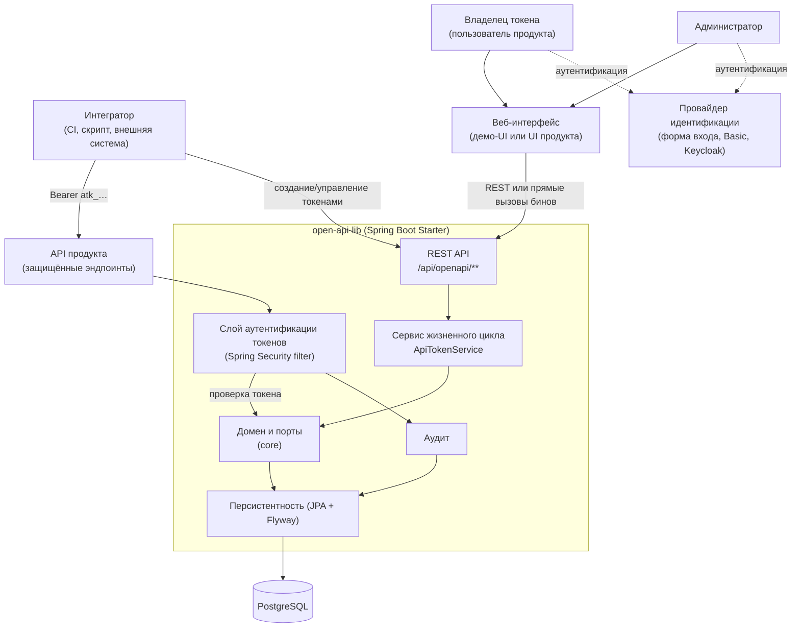
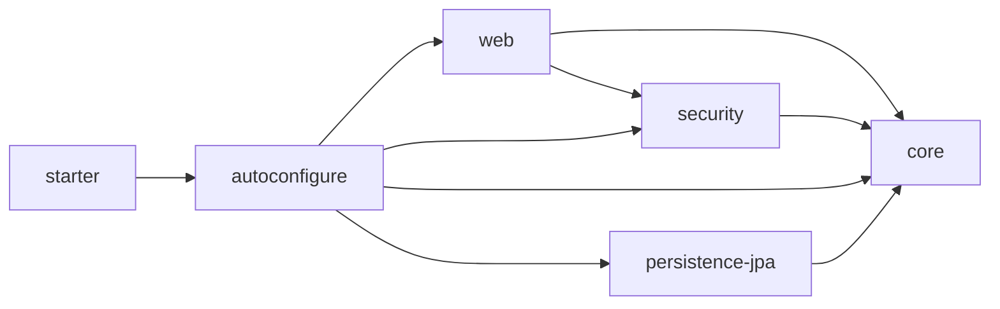
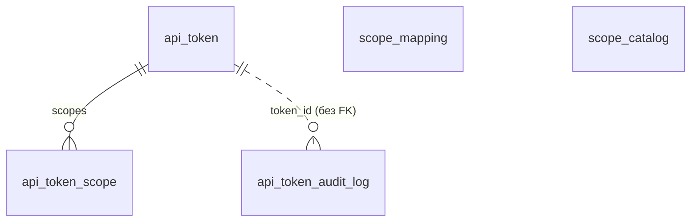
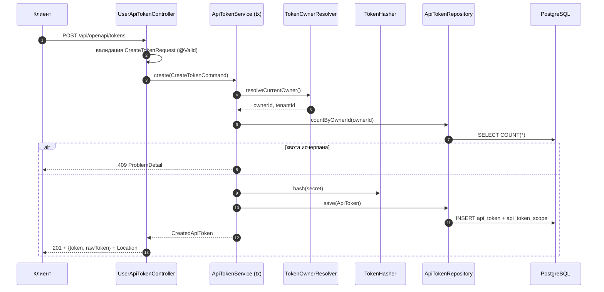
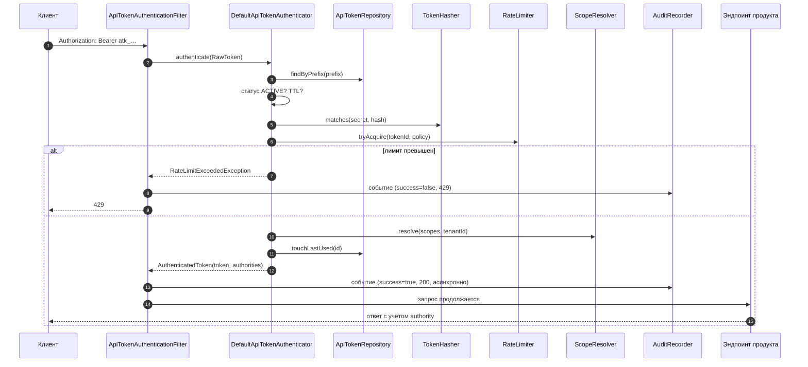
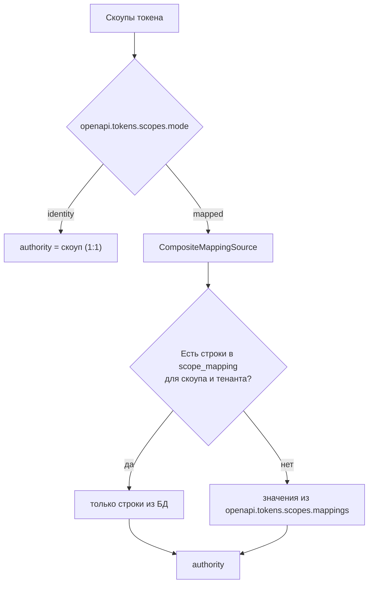
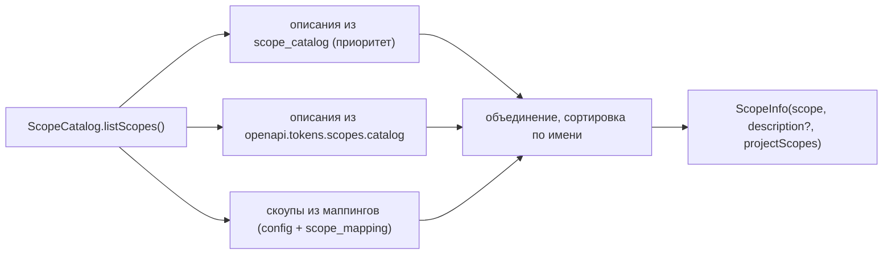
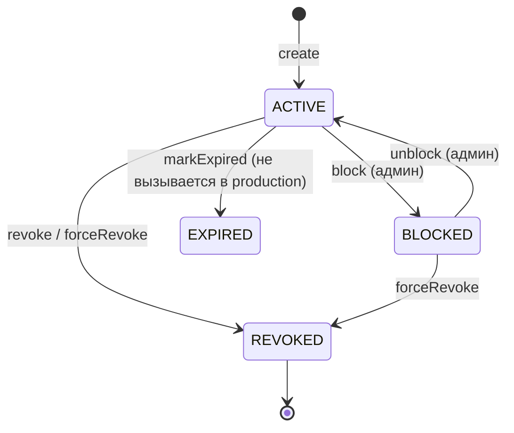

# Документация для системного аналитика

Раздел описывает систему как совокупность компонентов, контрактов и потоков данных:
контекст, интеграции, модель данных, API, состояния, отказы, нефункциональные требования
и точки расширения. Готов к использованию при проектировании интеграции и написании ТЗ.

---

## 1. Контекст системы

**Тип системы:** переиспользуемая библиотека (starter), встраиваемая в приложение продукта.
Не самостоятельный сервис: своего процесса, порта и БД у неё нет.

**Границы:**

- внутри — домен токенов, хранение, REST-контракт, аутентификация по токену, лимиты, аудит;
- снаружи — аутентификация пользователей, управление пользователями/ролями, продуктовые API,
  UI, эксплуатация БД и мониторинг.

---

## 2. Компоненты и их контракты

| Компонент | Модуль | Вход | Выход | Зависимости |
|---|---|---|---|---|
| Домен | `core` | Команды, агрегат | Инварианты, события | — (только утилиты хеширования) |
| Сервис жизненного цикла | `core` + `autoconfigure` | `Create/Revoke/BlockTokenCommand` | `ApiToken`, `CreatedApiToken`, `TokenUsageStats` | Порты |
| Аутентификация по токену | `security` | Сырой токен | `ApiTokenAuthentication` + authority | Репозиторий, хешер, резолвер скоупов, лимитер |
| REST API | `web` | HTTP-запрос | JSON / `ProblemDetail` | Сервис, маппер, аудит-репозиторий |
| Персистентность | `persistence-jpa` | Доменные объекты | Строки БД | JPA, Flyway, PostgreSQL |
| Конфигурация | `autoconfigure` | `openapi.tokens.*` | Бины | Все модули |

Матрица зависимостей (важно для планирования изменений):

Изменение `core` (порты, домен) — самое «дорогое»: затрагивает все модули и может потребовать
изменения SPI у потребителей.

---

## 3. Внешние интеграции

| Интеграция | Направление | Протокол | Обязательность | Комментарий |
|---|---|---|---|---|
| PostgreSQL | исходящая | JDBC | Обязательна для персистентности | Схему создаёт Flyway; нужны права DDL на старте |
| Провайдер идентификации пользователей | входящая | зависит от продукта (session, Basic, OIDC) | Обязательна | Библиотека читает готовый security context |
| Keycloak / OIDC | входящая | JWT (resource server / oauth2Login) | Опционально | Режим `auth.mode=keycloak`; нужен claim `sub` и claim тенанта |
| Redis | — | — | **Не поддерживается** | Лимитер только in-memory; Redis заявлен в roadmap |
| Продуктовые API | входящая | HTTP | — | Проверяют authority, полученные из токена |
| Внешние системы аудита/SIEM | — | — | **Не поддерживается** | Журнал только в БД; выгрузка — доработка |

---

## 4. Модель данных (краткая справка)

| Таблица | Назначение | Ключевые поля | Особенности |
|---|---|---|---|
| `api_token` | Токены | `id` (PK), `prefix` (UNIQUE), `token_hash`, `owner_id`, `tenant_id`, `status`, `expires_at`, `sliding_ttl_seconds`, `last_used_at`, `rate_limit_*`, `created_at`, `revoked_at`, `created_by` | Секрет не хранится |
| `api_token_scope` | Скоупы токена | `(token_id, scope)` PK, FK CASCADE | Порядок не сохраняется, дубликаты невозможны |
| `scope_mapping` | Маппинги 1:M | `id` (PK), `token_scope`, `project_scope`, `tenant_id` | `tenant_id NULL` = общая строка; уникальность не защищает от NULL-дублей |
| `scope_catalog` | Описания скоупов | `scope` (PK), `description` | Приоритетнее конфигурации |
| `api_token_audit_log` | Журнал обращений | `id` (BIGSERIAL), `token_id`, `action`, `success`, `response_status`, `created_at` | Нет FK на токен; не чистится автоматически |

Полное DDL, индексы и ограничения — [Модель данных](../architecture/data-model.md).

---

## 5. Контракты API (сводка)

### Пользовательские

| Метод | Путь | Тело запроса | Успех | Ошибки |
|---|---|---|---|---|
| `POST` | `/api/openapi/tokens` | `CreateTokenRequest` | `201` + `CreatedTokenResponse` + `Location` | `400`, `409`, `401/403` |
| `GET` | `/api/openapi/tokens` | — | `200` + `ApiTokenResponse[]` | `401/403` |
| `GET` | `/api/openapi/tokens/{id}` | — | `200` + `ApiTokenResponse` | `404`, `401/403` |
| `DELETE` | `/api/openapi/tokens/{id}` | — | `204` | `400`, `404`, `401/403` |
| `GET` | `/api/openapi/tokens/{id}/stats` | — | `200` + `TokenUsageStatsResponse` | `404`, `401/403` |
| `GET` | `/api/openapi/tokens/{id}/audit` | — | `200` + события (≤ 50) | `404`, `401/403` |

### Административные (`ROLE_ADMIN`)

| Метод | Путь | Успех |
|---|---|---|
| `GET` | `/api/openapi/admin/tokens` | `200` + все токены |
| `GET` | `/api/openapi/admin/tokens/{id}` | `200` |
| `GET` | `/api/openapi/admin/tokens/{id}/audit` | `200` + события (≤ 100) |
| `DELETE` | `/api/openapi/admin/tokens/{id}` | `204` |
| `POST` | `/api/openapi/admin/tokens/{id}/block` | `200` |
| `POST` | `/api/openapi/admin/tokens/{id}/unblock` | `200` |

### Справочник

| Метод | Путь | Успех |
|---|---|---|
| `GET` | `/api/openapi/scopes` | `200` + `ScopeInfoResponse[]` |

Детальные схемы полей, примеры JSON и коды ошибок — [REST API](../api/rest-api.md).

!!! note "Что стоит зафиксировать в ТЗ как «известные дефекты контракта»"
    1. Аудит-эндпоинты **не поддерживают пагинацию**: всегда первые 50/100 записей.
    2. `DELETE` не идемпотентен: повторный вызов даёт `400`, а не `204`.
    3. Ошибки аутентификации (`401`, `429`) возвращаются не в формате `ProblemDetail`,
       а как стандартная страница ошибки контейнера; заголовка `Retry-After` нет.
    4. `ApiTokenResponse` не содержит `slidingTtlSeconds` и параметров лимита — для отображения
       в UI их придётся добавлять в DTO (доработка).
    5. Административный список не фильтруется и не постраничен на сервере.

---

## 6. Ключевые потоки

### 6.1 Выпуск токена

### 6.2 Аутентификация запроса по токену

### 6.3 Разрешение скоупов

### 6.4 Чтение справочника скоупов

---

## 7. Жизненный цикл и состояния

| Проверка при аутентификации | Условие отказа |
|---|---|
| Статус | не `ACTIVE` |
| Абсолютный TTL | `now >= expiresAt` |
| Скользящий TTL | `now >= (lastUsedAt ?: createdAt) + slidingTtl` |
| Секрет | хеш не совпадает |
| Лимит частоты | ведро пусто |

!!! warning "Состояние `EXPIRED` недостижимо в runtime"
    Переход в `EXPIRED` в production-коде не выполняется. Просроченный токен остаётся
    `ACTIVE` в БД, но не проходит аутентификацию. Любая логика, опирающаяся на статус
    из БД, должна дополнительно проверять `expires_at` и `last_used_at + sliding_ttl_seconds`.

---

## 8. Каталог отказов

| Код | Причина | Формат ответа | Источник |
|---|---|---|---|
| `400` | Ошибка валидации полей запроса | `ProblemDetail`, title `Validation Failed` | `MethodArgumentNotValidException` |
| `400` | Недопустимый переход состояния, пустые скоупы, некорректные аргументы | `ProblemDetail`, title `Invalid Token Request` | доменные исключения |
| `401` | Формат токена, неизвестный префикс, неверный секрет, статус, TTL | страница ошибки, текст `Unauthorized` | `ApiTokenAuthenticationFilter` |
| `403` | Нет прав на административные эндпоинты / отсутствует CSRF в UI | зависит от конфигурации | Spring Security |
| `404` | Токен не найден или принадлежит другому владельцу | `ProblemDetail`, title `API Token Not Found` | `ApiTokenExceptionHandler` |
| `409` | Превышена квота токенов | `ProblemDetail`, title `Token Quota Exceeded` | `QuotaExceededException` |
| `429` | Превышен лимит частоты | страница ошибки, текст `Rate limit exceeded` | фильтр |
| `500` | Нарушение целостности (уникальность префикса), недоступность БД | стандартная ошибка Boot | не обрабатывается |

---

## 9. Нефункциональные требования и фактические характеристики

| Аспект | Текущее состояние | Рекомендация для продукта |
|---|---|---|
| **Производительность аутентификации** | На каждый запрос: SELECT по префиксу + Argon2id-проверка (3 итерации, 64 МиБ) + возможный `touchLastUsed` (UPDATE) + перечитывание токена | При высокой нагрузке кешировать результат проверки токена или снизить параметры хеширования своим бином |
| **Запись на каждый запрос** | `touchLastUsed` выполняется при каждой успешной аутентификации (лишний UPDATE) | Рассмотреть батчинг/отложенную запись |
| **Аудит** | Асинхронный, отдельный пул (2–4 потока) | При большом потоке событий увеличить пул или вынести в очередь |
| **Масштабирование** | Stateless, кроме rate limiter (in-memory на узел) | Для кластера — внешний лимитер |
| **Согласованность** | Оптимистичных блокировок нет; параллельные изменения — «последний победил» | При конкурентном администрировании учесть риск |
| **Транзакции** | Мутации в `@Transactional`, чтения `readOnly` | — |
| **Отказоустойчивость** | Сбой записи аудита не влияет на запрос (логируется) | Мониторить лог `Failed to append audit event` |
| **Безопасность хранения** | Только хеш секрета (Argon2id/BCrypt) | — |
| **Аудит-полнота** | Только использование токенов | Дополнить событиями выпуска/отзыва при требованиях комплаенса |
| **Ретеншн** | Не ограничен | Регламент очистки/партиционирование |
| **Наблюдаемость** | Логи SLF4J (`ru.openapi.tokens`), метрик нет | Добавить метрики (Micrometer) своими средствами |
| **Идемпотентность** | Нет (повторный `DELETE` → 400) | Учесть в клиентах/ретраях |
| **Постраничность** | Нет в API; в аудите — «первые N» | Для больших объёмов — доработка SPI |
| **Мультитенантность** | `tenant_id` есть в токене, маппингах и аудите; фильтрация маппингов по тенанту есть, у токенов — нет | При строгой изоляции добавить фильтрацию токенов по тенанту (доработка) |

---

## 10. Требования безопасности (для ТЗ)

| ID | Требование | Статус в библиотеке |
|---|---|---|
| SEC-1 | Секрет токена не хранится в открытом виде | ✅ Argon2id/BCrypt |
| SEC-2 | Секрет показывается один раз | ✅ |
| SEC-3 | Проверка статуса и срока на каждом запросе | ✅ |
| SEC-4 | Не раскрывать существование чужого токена | ✅ 404 |
| SEC-5 | Ограничение частоты обращений по токену | ⚠️ только in-memory, только для токенов |
| SEC-6 | Аудит попыток использования | ✅ (только аутентификация) |
| SEC-7 | Ограничение набора выдаваемых скоупов | ❌ **не реализовано** — обязательная доработка продукта |
| SEC-8 | Тенант берётся только из доверенного источника | ❌ принимается из запроса |
| SEC-9 | Административные эндпоинты защищены ролью | ✅ `hasRole("ADMIN")` в готовой цепочке |
| SEC-10 | Ротация/истечение секретов по политике | ⚠️ только через TTL токена |
| SEC-11 | Маскирование PII в журнале | ❌ `ip` и `user_agent` пишутся как есть |

---

## 11. Точки расширения (для проектных решений)

| Что нужно изменить | Как | Влияние на продукт |
|---|---|---|
| Хранилище (не PostgreSQL/JPA) | Свой бин `ApiTokenRepository` и/или исключение JPA-автоконфигурации | Нужна реализация 7 методов порта |
| Распределённый rate limit | Свой `RateLimiter` | Нужны Redis/внешний счётчик |
| Логика прав | Свой `ScopeResolver` | — |
| Владелец (не из SecurityContext) | Свой `TokenOwnerResolver` | — |
| Хеширование | Свой `TokenHasher` | Смена алгоритма делает старые хеши нечитаемыми |
| Аудит (SIEM, no-op) | Свой `AuditRecorder` | — |
| Справочник скоупов | Свой `ScopeCatalog` | — |
| Безопасность `/api/openapi/**` | Свой бин `openapiTokensSecurityFilterChain` | Нужно описать правила целиком |
| Полное отключение | `openapi.tokens.enabled=false` | Функциональность исчезает целиком |

---

## 12. Развёртывание и эксплуатация

| Аспект | Значение |
|---|---|
| Артефакт | `ru.openapi:openapi-tokens-spring-boot-starter:0.1.0-SNAPSHOT` (публикация не настроена) |
| Способ подключения | `includeBuild` / локальный репозиторий |
| Миграции | Flyway, `V1__api_tokens.sql`, `V2__scope_catalog.sql` из jar библиотеки; занимают версии 1 и 2 в истории миграций приложения |
| Требуемые права БД | DDL на старте (для Flyway), DML в работе |
| Конфигурация | `openapi.tokens.*` + `spring.datasource.*`, `spring.jpa.hibernate.ddl-auto=validate`, `spring.flyway.enabled=true` |
| Мониторинг | Логи `ru.openapi.tokens`; отдельно — ошибки записи аудита; размер `api_token_audit_log` |
| Бэкап | Обычный бэкап БД; секреты в БД отсутствуют в открытом виде |
| Совместимость | Java 21, Spring Boot 3.4.x, Spring Security 6 |
| Границы версий | Схема и SPI меняются вместе с версией библиотеки — при обновлении проверять миграции и порты |

---

## 13. Тестовое покрытие (что можно считать проверенным)

| Область | Покрытие |
|---|---|
| Домен, TTL, формат токена, хешеры | ✅ модульные тесты + BDD (Cucumber) |
| Сервис жизненного цикла (квота, отзыв, владелец) | ✅ модульные + BDD |
| Разрешение скоупов (identity/mapped, приоритет БД) | ✅ модульные + BDD |
| Лимитер частоты | ✅ модульные (с управляемым временем) |
| Аутентификатор (порядок проверок) | ✅ модульные |
| Резолвер владельца Keycloak | ✅ модульные |
| Персистентность (JPA + Flyway) | ✅ интеграционные (Testcontainers, PostgreSQL 16) |
| Автоконфигурация (вкл/выкл, справочник) | ✅ `ApplicationContextRunner` |
| REST-контроллеры | ✅ частично (создание, список, отзыв, статистика, блокировка) |
| Фильтр аутентификации, цепочка безопасности, `ProblemDetail`-ответы, транзакции | ❌ нет тестов |
| E2E (реальное приложение + БД) | ✅ один happy-path сценарий в демо |

Детальнее — [Тестирование](../operations/testing.md).

---

## 14. Открытые вопросы и решения

| # | Вопрос | Текущий ответ |
|---|---|---|
| 1 | Как ограничивать выдаваемые скоупы? | Не реализовано — требуется решение продукта (белый список/пересечение с правами пользователя) |
| 2 | Что делать с просроченными токенами в отчётах? | Считать «фактический статус» по срокам; `EXPIRED` в БД не появляется |
| 3 | Нужна ли постраничность? | Нет в текущем SPI; для больших объёмов — доработка портов и API |
| 4 | Как изолировать мультитенантность токенов? | Фильтрация токенов по тенанту отсутствует; маппинги фильтруются |
| 5 | Как обеспечить распределённый лимит? | Внешний `RateLimiter` или лимит на шлюзе |
| 6 | Как жить с версиями миграций в общем приложении? | Переименовать файлы библиотеки до первого применения или использовать `spring.flyway.table` |
| 7 | Как чистить журнал аудита? | Регламентная задача/партиционирование — вне библиотеки |
| 8 | Что с публикацией артефакта? | Не настроена; требуется `maven-publish` и репозиторий |

---

## 15. Связанные разделы

- [Модель данных](../architecture/data-model.md) — полное DDL и ограничения.
- [Обзор архитектуры](../architecture/index.md) — слои, потоки, решения.
- [REST API](../api/rest-api.md) — контракты и схемы.
- [Порты и SPI](../api/spi.md) — точки расширения.
- [Конфигурация](../configuration.md) — все свойства.
- [Бизнес-аналитику](business-analyst.md) — правила и сценарии.
- [Ограничения и roadmap](../operations/roadmap.md) — что планируется изменить.
