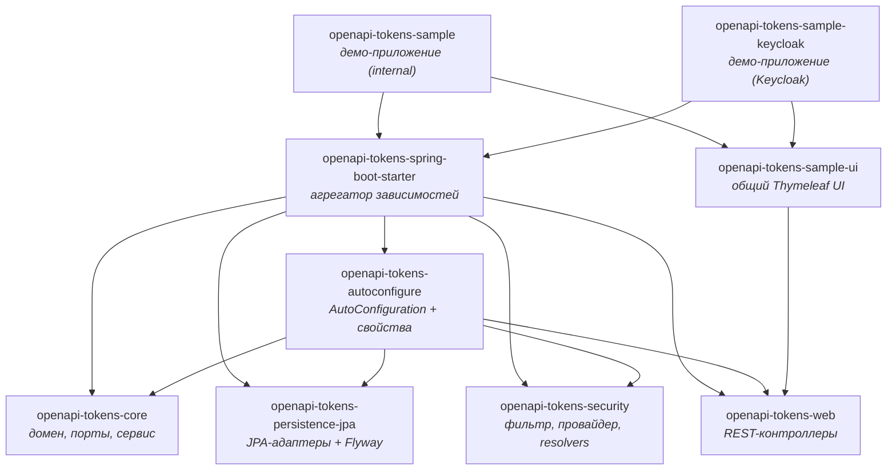

# open-api-lib

**Переиспользуемый Spring Boot Starter для API-токенов** в стиле GitHub Personal Access Tokens:
выпуск и отзыв токенов, скоупы (1:1 и 1:M), абсолютный и скользящий TTL, rate limiting,
аудит обращений, интеграция со Spring Security и опциональное определение владельца по Keycloak.

Библиотека решает одну задачу: **дать вашему продукту собственную систему API-токенов** —
такую, которой смогут пользоваться внешние интеграторы, CI/CD-пайплайны, скрипты и партнёры,
без того чтобы выдавать им логин и пароль или делать собственный долгоживущий JWT.

---

## Какую проблему решает библиотека

Когда у продукта появляется публичный (или партнёрский) HTTP API, почти сразу возникает
потребность в «машинных» учётных данных:

| Проблема | Что даёт open-api-lib |
|---|---|
| Пароль нельзя дать CI-системе: его не отозвать точечно, он даёт полный доступ | Отдельная сущность «токен» с ограниченными скоупами, которую можно отозвать в любой момент, не меняя пароль пользователя |
| Токен должен быть видён **один раз**, а в БД храниться в необратимом виде | Секрет показывается только в ответе на создание; в базе лежит Argon2id/BCrypt-хеш, поиск идёт по публичному префиксу |
| Нужны разные права для разных интеграций | Скоупы: в режиме `identity` — 1:1 с правами приложения, в режиме `mapped` — 1:M через конфиг или таблицу `scope_mapping` |
| Токен «живёт вечно» и никто его не перевыпускает | Абсолютный TTL (`expiresAt`) и/или скользящий TTL (`slidingTtlSeconds`), обновляемый при каждом обращении |
| Один интегратор «выжигает» квоту запросов | Пер-токенный rate limit на Bucket4j с настраиваемым окном |
| Нужно расследовать инцидент: кто и когда ходил этим токеном | Аудит-журнал (`token_audit_log`) и статистика использования по токену |
| Каждый продукт пишет это заново | Готовые REST-контроллеры, фильтр Spring Security, авто-конфигурация и точки расширения (SPI) для замены любого компонента |

---

## Ключевые возможности

- **Жизненный цикл токена** — создание, отзыв (revoke), блокировка/разблокировка администратором,
  статусы `ACTIVE` / `BLOCKED` / `REVOKED` / `EXPIRED`, квота токенов на владельца.
- **Формат токена** `atk_<prefix>_<secret>` — публичный префикс для поиска + 32 байта энтропии
  в секрете; секрет хешируется Argon2id (по умолчанию) или BCrypt.
- **Скоупы** — 1:1 (`identity`) и 1:M (`mapped`), конфигурационные и хранимые в БД маппинги,
  справочник скоупов с человекочитаемыми описаниями (`GET /api/openapi/scopes`).
- **TTL** — абсолютный срок жизни и/или скользящее окно, продлеваемое при успешной аутентификации.
- **Rate limiting** — per-token политика (запросов в окно), in-memory backend на Bucket4j.
- **Spring Security** — `ApiTokenAuthenticationFilter`, `AuthenticationProvider`, `PermissionEvaluator`;
  готовый `SecurityFilterChain` для `/api/openapi/**`; режимы `internal` и `keycloak`.
- **Аудит и статистика** — асинхронная запись событий аутентификации, статистика
  (всего/успешных/неуспешных обращений, время последнего использования).
- **REST API «из коробки»** — пользовательские и административные контроллеры токенов и справочник скоупов.
- **Точки расширения** — любой компонент (хешер, хранилище, rate limiter, resolver прав,
  каталог скоупов, аудит) заменяется своим бином через `@ConditionalOnMissingBean`.
- **Демо-приложение** — `openapi-tokens-sample` + `openapi-tokens-sample-ui`: REST API, форма логина
  и server-rendered UI для пользователя и администратора (Thymeleaf, без CDN).

Полный каталог функций с указанием, где что настраивается, — в разделе
[Обзор функций](features/index.md).

---

## Состав репозитория



| Модуль | Назначение |
|---|---|
| [`openapi-tokens-core`](api/java-api.md) | Домен (`ApiToken`, `RawToken`, `TokenExpiry`, `TokenStatus`), порты (SPI), хешеры, резолверы скоупов, rate limiter, `DefaultApiTokenService`. Без Spring и без JPA. |
| `openapi-tokens-persistence-jpa` | JPA-сущности, Spring Data репозитории, адаптеры портов, Flyway-миграции `V1__api_tokens.sql`, `V2__scope_catalog.sql`. |
| `openapi-tokens-security` | `ApiTokenAuthenticationFilter`, `ApiTokenAuthenticationProvider`, `ApiTokenAuthentication`, `ApiTokenPermissionEvaluator`, `InternalTokenOwnerResolver`, `KeycloakTokenOwnerResolver`. |
| `openapi-tokens-web` | REST-контроллеры `/api/openapi/tokens`, `/api/openapi/admin/tokens`, `/api/openapi/scopes`, DTO и `@RestControllerAdvice` с `ProblemDetail`. |
| `openapi-tokens-autoconfigure` | `OpenApiTokensAutoConfiguration`, `OpenApiTokensPersistenceAutoConfiguration`, `OpenApiTokensProperties`, `TransactionalApiTokenService`. |
| `openapi-tokens-spring-boot-starter` | Пустой модуль-агрегатор: `api(project(...))` на все модули. Именно его подключает продукт. |
| `openapi-tokens-sample` | Демо-приложение (`auth.mode=internal`): конфигурация, security, демо-API `/api/demo/**`, форма логина. |
| `openapi-tokens-sample-ui` | Библиотека server-rendered UI: страницы пользователя и администратора (`/ui/**`, `/admin/**`), `TokenUiSecurity`, локальный CSS. Переиспользуется обоими демо-приложениями. |
| `openapi-tokens-sample-keycloak` | Демо-приложение (`auth.mode=keycloak`): импорт realm, вход по authorization code flow, приём Keycloak access token и API-токена, маппинг ролей Keycloak в `ROLE_*`. См. [Keycloak](guides/keycloak.md). |

!!! tip "Два демо-приложения — два режима аутентификации"
    `openapi-tokens-sample` показывает режим `internal` (пользователи в памяти, form login,
    порт 8080, БД `openapi_tokens`). `openapi-tokens-sample-keycloak` показывает режим `keycloak`
    (OIDC-вход через Keycloak, порт 8081, БД `openapi_tokens_keycloak`, Keycloak на 8180).
    Оба используют один и тот же UI-модуль и starter.

---

## Требования

| Компонент | Версия |
|---|---|
| JDK | 21+ (toolchain зафиксирован на Java 21) |
| Spring Boot | 3.4+ (BOM `spring-boot-dependencies:3.4.1`) |
| Spring Security | входит в Boot starter; нужен для модуля `security` |
| СУБД | PostgreSQL — Flyway-миграции написаны под него; JPA-слой в остальном переносим |
| Gradle | wrapper в репозитории |

---

## Подключение за 30 секунд

```kotlin
// build.gradle.kts
dependencies {
    implementation("ru.openapi:openapi-tokens-spring-boot-starter:0.1.0-SNAPSHOT")
}
```

```yaml
# application.yml
openapi:
  tokens:
    enabled: true
    auth:
      mode: internal        # internal | keycloak
    scopes:
      mode: identity        # identity | mapped
```

Дальше — [Быстрый старт](getting-started.md): база, миграции, первый токен и вызов защищённого
эндпоинта.

---

## Документация по ролям

| Роль | Раздел | Что внутри |
|---|---|---|
| **Бизнес-аналитик** | [guides/business-analyst.md](guides/business-analyst.md) | Возможности на языке бизнеса, роли, сценарии использования, правила и ограничения, критерии приёмки |
| **Системный аналитик** | [guides/system-analyst.md](guides/system-analyst.md) | Модель данных, диаграмма состояний, последовательности вызовов, контракты API, интеграции, нефункциональные требования |
| **Фронтенд-разработчик** | [guides/frontend.md](guides/frontend.md) | REST-контракты с примерами JSON, коды ошибок, сценарии экранов, CSRF/Auth, работа с одноразовым секретом |
| **Бэкенд-разработчик** | [guides/backend.md](guides/backend.md) | Подключение starter'а, конфигурация, SPI и замена компонентов, транзакции, миграции, свой SecurityFilterChain |
| **Все** | [configuration.md](configuration.md) | Полный справочник `openapi.tokens.*` с типами и значениями по умолчанию |

---

## Лицензия и статус

Версия `0.1.0-SNAPSHOT` — библиотека в активной разработке. Публикация в Maven-репозиторий
не настроена (`maven-publish` в модулях отсутствует), подключение предполагается через
`includeBuild` / локальный репозиторий. См. [Ограничения и roadmap](operations/roadmap.md).
