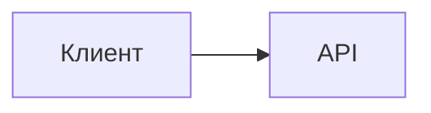

# Публикация документации

Документация написана в Markdown и собирается в статический сайт генератором
**MkDocs Material**. Сайт можно опубликовать на GitHub Pages, GitLab Pages или любом
статическом хостинге.

---

## 1. Структура

| Файл / каталог | Назначение |
|---|---|
| `mkdocs.yml` | Конфигурация сайта: навигация, тема, расширения Markdown, поиск |
| `docs/**/*.md` | Источник документации (Markdown — источник истины) |
| `docs/stylesheets/extra.css` | Небольшие правки стилей |
| `requirements-docs.txt` | Зафиксированные версии MkDocs и темы |
| `.github/workflows/docs.yml` | Сборка и публикация на GitHub Pages |
| `.gitlab-ci.yml` | Job `pages` для GitLab Pages |
| `site/` | Результат сборки (в `.gitignore`, в репозиторий не коммитится) |

Каталог `docs/plans/**` (служебные документы планирования) исключён из сборки через
`exclude_docs` — он остаётся в репозитории, но не публикуется на сайте.

---

## 2. Локальный предпросмотр

```bash
python3 -m venv .venv-docs
source .venv-docs/bin/activate
pip install -r requirements-docs.txt

mkdocs serve            # http://127.0.0.1:8000
mkdocs build            # сборка в ./site
mkdocs build --strict   # сборка с ошибкой на любое предупреждение
```

Проверка результата без сервера MkDocs:

```bash
python3 -m http.server 8000 --directory site
```

!!! tip "Живая перезагрузка"
    `mkdocs serve` автоматически пересобирает сайт при изменении `.md`-файлов и `mkdocs.yml`.

---

## 3. GitHub Pages

Workflow `.github/workflows/docs.yml` собирает сайт и публикует его через
`actions/deploy-pages` (ветка не нужна, используется артефакт).

**Что нужно сделать один раз:**

1. Запушьте репозиторий на GitHub.
2. Откройте **Settings → Pages** и выберите **Source: GitHub Actions**.
3. Запушьте изменения в `docs/**`, `mkdocs.yml` или `requirements-docs.txt` (или запустите
   workflow вручную через **Actions → docs → Run workflow**).

**Что происходит:** checkout → Python 3.12 → `pip install -r requirements-docs.txt` →
`mkdocs build --strict` → загрузка артефакта `site` → деплой.

`SITE_URL` подставляется автоматически из `actions/configure-pages` (значение
`base_url`), поэтому ссылки и поиск работают и для project pages
(`https://<owner>.github.io/<repo>/`), и для user pages.

### Альтернатива: публикация веткой

Если не хочется использовать Actions:

```bash
pip install -r requirements-docs.txt
mkdocs gh-deploy --force          # создаст/обновит ветку gh-pages
```

Затем **Settings → Pages → Source: Deploy from a branch → `gh-pages` / `/ (root)`**.

При этом варианте задайте `site_url` в `mkdocs.yml` (или переменную окружения `SITE_URL`)
вручную — без этого могут некорректно работать абсолютные ссылки и поиск.

---

## 4. GitLab Pages

Job `pages` в `.gitlab-ci.yml` собирает сайт в каталог `public` и отдаёт его как артефакт —
именно этот каталог GitLab Pages публикует.

```yaml
pages:
  stage: docs
  image: python:3.12-slim
  variables:
    PIP_CACHE_DIR: "$CI_PROJECT_DIR/.cache/pip"
  cache:
    key: docs-pip
    paths:
      - .cache/pip
  before_script:
    - pip install --no-cache-dir -r requirements-docs.txt
  script:
    - mkdocs build --strict --site-dir public
  artifacts:
    paths:
      - public
    expire_in: 30 days
  rules:
    - if: $CI_COMMIT_BRANCH == $CI_DEFAULT_BRANCH
  environment:
    name: pages
    url: $CI_PAGES_URL
```

`SITE_URL` берётся из предопределённой переменной GitLab `CI_PAGES_URL` (см. `mkdocs.yml`,
где `site_url: !ENV [SITE_URL, "..."]`).

**Что нужно сделать:**

1. Запушьте репозиторий в GitLab.
2. Убедитесь, что для проекта включены Pages (обычно включены по умолчанию).
3. Запустите pipeline в дефолтной ветке — job `pages` создаст сайт.
4. Адрес сайта смотрите в **Deploy → Pages** (обычно `https://<namespace>.gitlab.io/<project>/`).

!!! note "Если Gradle-сборка идёт в том же pipeline"
    Job `pages` независим — он только собирает документацию. Чтобы он не запускался на
    каждом коммите, используйте в нём правило по изменённым путям:

    ```yaml
    rules:
      - if: $CI_COMMIT_BRANCH == $CI_DEFAULT_BRANCH
        changes:
          - docs/**/*
          - mkdocs.yml
          - requirements-docs.txt
    ```

---

## 5. Настройка сайта

### Адрес сайта

```yaml
site_url: !ENV [SITE_URL, "https://example.com/open-api-lib/"]
```

- в CI значение подставляется из переменной окружения `SITE_URL`;
- локально используется значение по умолчанию — замените его на реальный адрес.

### Ссылки на репозиторий

Раскомментируйте в `mkdocs.yml`, чтобы в шапке появилась ссылка на исходники и кнопки
«Edit this page»:

```yaml
repo_url: https://github.com/<owner>/open-api-lib
repo_name: <owner>/open-api-lib
edit_uri: edit/main/docs/
```

### Навигация

Разделы описаны в `nav:` в `mkdocs.yml`. Новый файл в `docs/` появится на сайте только после
добавления в `nav` (иначе MkDocs выдаст предупреждение и не включит страницу в меню).

### Диаграммы

Mermaid включён через `pymdownx.superfences` (кастомный fence `mermaid`) — диаграммы
рендерятся браузером, дополнительных плагинов не требуется:

````markdown

````

### Поиск и тема

- Поиск встроенный (`plugins: search`, язык `ru`), работает на статике;
- светлая/тёмная тема переключается автоматически и вручную;
- сторонние CDN не используются, кроме загрузки шрифтов темой (сайт остаётся
  работоспособным и без них).

---

## 6. Обновление документации

| Что меняется | Что править |
|---|---|
| Новая функция | `docs/features/*.md` + строка в `docs/features/index.md` |
| Новое свойство | `docs/configuration.md` |
| Новый эндпоинт | `docs/api/rest-api.md`, при необходимости `docs/guides/frontend.md` |
| Изменение схемы БД | `docs/architecture/data-model.md` (+ миграция) |
| Изменение портов/условий | `docs/api/spi.md`, `docs/architecture/index.md` |
| Известный дефект/план | `docs/operations/roadmap.md` |
| Новая страница | файл в `docs/**` + запись в `nav` в `mkdocs.yml` |

Рекомендация: держите `README.md` коротким и ссылайтесь из него на сайт — единственным
источником истины должна быть папка `docs/`.

---

## 7. Возможные проблемы

| Проблема | Причина | Решение |
|---|---|---|
| `mkdocs: command not found` | Не активировано окружение / не установлены зависимости | `source .venv-docs/bin/activate && pip install -r requirements-docs.txt` |
| Предупреждение «The following pages exist … but are not included in the nav» | Файл не добавлен в `nav` | Добавьте в `nav` или в `not_in_nav` |
| `--strict` валит сборку на предупреждении | Строгий режим | Исправьте предупреждение (обычно битая ссылка или файл вне `nav`) |
| Ссылки ломаются на Pages | Не задан `site_url` | Задайте `site_url` или переменную `SITE_URL` |
| Диаграммы показываются как код | Не включён fence `mermaid` | Проверьте `pymdownx.superfences.custom_fences` в `mkdocs.yml` |
| GitLab job не создаёт сайт | Неверное имя каталога артефакта | Артефакт обязан называться `public` |
| GitHub Pages показывает 404 | Не выбран источник Actions | **Settings → Pages → Source: GitHub Actions** |

## Связанные разделы

- [Тестирование](testing.md) — тесты проекта (отдельный pipeline).
- [Ограничения и roadmap](roadmap.md) — что ещё предстоит сделать.
