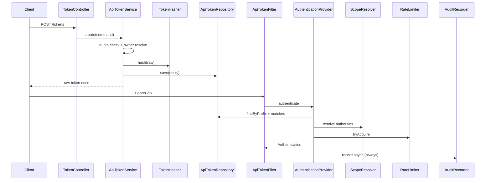

# API Tokens Spring Boot Starter

## Overview

- Переиспользуемый **Spring Boot Starter** для API-токенов (аналог GitHub Personal Access Tokens): M2M и автоматизация через REST API.
- Решает: создание/отзыв токенов, scopes (1:1 и 1:M), TTL (absolute + sliding), rate limit, аудит, интеграция со Spring Security, опциональный Keycloak.
- Продукты подключают starter зависимостью; при `openapi.tokens.enabled=false` бины не поднимаются.

## Context (from discovery)

- Репозиторий greenfield: только `.cursor/rules/java-senior.mdc`.
- Stack target: Java 21, Spring Boot 3.x, Gradle multi-module, JPA + Flyway, Testcontainers.
- Amplicode MCP недоступен — план и реализация без него.
- Согласованные решения:
  - **Модули:** Option A — 5 модулей (+ starter aggregator).
  - **Rate limit:** Bucket4j in-memory + порт (`RateLimiter`); Redis — post-MVP.
  - **Scope mapping:** гибрид YAML + таблица `scope_mapping`.
  - **Аудит:** все попытки (успех, 401/403, rate-limit deny, invalid token).
  - **Owner:** `TokenOwnerResolver` + Internal / Keycloak(`sub`).
  - **Multi-tenancy:** опциональный nullable `tenant_id`.
  - **Тесты:** TDD (feature/тесты → код → green).

## Development Approach

- **testing approach**: TDD
- Complete each task fully before moving to the next
- Small, focused changes
- **CRITICAL:** every task MUST include new/updated tests
- **CRITICAL:** all tests must pass before starting next task
- **CRITICAL:** update this plan file when scope changes
- BDD: Gherkin feature-файлы для бизнес-сценариев (создание, auth, scopes, rate limit, revoke)
- Unit: Mockito + AssertJ; Integration: Testcontainers (PostgreSQL)
- Следовать `java-senior.mdc`: package-by-feature внутри модулей, DTO↔Entity isolation, constructor injection, `jakarta.*`, ArchUnit

## Testing Strategy

- **BDD (Cucumber):** жизненный цикл токена, проверка прав 1:1 и 1:M, rate limit, аудит
- **Unit:** hasher, scope resolvers, rate limiter, services, filters (без Spring context)
- **Slice/Integration:** `@DataJpaTest` + Testcontainers; `@WebMvcTest` для controllers; Security filter chain
- **e2e:** не применимо (library, не UI)

## Progress Tracking

- Mark completed with `[x]` immediately when done
- Newly discovered: `[+]` prefix
- Blockers: `[!]` prefix
- Keep plan in sync with actual work

## Solution Overview

### Modules

```
open-api-lib/
├── openapi-tokens-core                 # domain, ports, value objects
├── openapi-tokens-persistence-jpa      # JPA adapters + Flyway
├── openapi-tokens-security             # filter, AuthenticationProvider, PermissionEvaluator
├── openapi-tokens-web                  # user + admin REST
├── openapi-tokens-autoconfigure        # AutoConfiguration + ConfigurationProperties
└── openapi-tokens-spring-boot-starter  # dependency aggregator + AutoConfiguration.imports
```

### Public ports (core)

| Port | Responsibility |
|------|----------------|
| `ApiTokenService` | create / revoke / block / list / get / usage stats |
| `ApiTokenAuthenticator` | raw token → authenticated principal |
| `ScopeResolver` | token scopes → project authorities |
| `RateLimiter` | `tryAcquire(tokenId)` |
| `TokenHasher` | hash / matches (default Argon2id) |
| `AuditRecorder` | async audit write |
| `TokenOwnerResolver` | resolve current owner id (+ optional tenant) |
| `ApiTokenPermissionChecker` | programmatic permission checks |
| `ApiTokenRepository` (port) | persistence abstraction |
| `ScopeMappingRepository` (port) | hybrid mapping storage |
| `AuditLogRepository` (port) | audit persistence |

### Strategies

- Scopes: `IdentityScopeResolver` (1:1), `MappedScopeResolver` (1:M), selected by `openapi.tokens.scopes.mode`
- Mapping source: config bindings + DB rows (DB wins on conflict / merges with config)
- Auth mode: `internal` | `keycloak` via `@ConditionalOnProperty` / `@ConditionalOnClass`
- Hashing: Argon2id default, BCrypt alternative via property

### Security flow

1. `ApiTokenAuthenticationFilter` extracts `Authorization: Bearer atk_…`
2. `ApiTokenAuthenticationProvider` loads by prefix, verifies hash, checks status/TTL/sliding
3. Resolves authorities via `ScopeResolver`
4. `RateLimiter.tryAcquire` — deny → 429 + audit
5. Sets `ApiTokenAuthentication` in SecurityContext
6. `AuditFilter` / interceptor records outcome asynchronously (success and failures)

### Token format

- Raw (shown once): `atk_<prefix>_<secret>`
- DB stores: `prefix` + `token_hash` only

## Technical Details

### Configuration (defaults)

```yaml
openapi:
  tokens:
    enabled: true
    auth:
      mode: internal                 # internal | keycloak
    scopes:
      mode: identity                 # identity | mapped
      mappings: {}                   # payment: [createPayment, ...]
    hashing:
      algorithm: argon2              # argon2 | bcrypt
    rate-limit:
      backend: memory                # memory (Bucket4j); redis later
    audit:
      enabled: true
      async: true
      record-failures: true
    limits:
      max-tokens-per-owner: 10
    token:
      prefix-length: 8
      default-ttl: 90d
      header: Authorization
      bearer-prefix: "Bearer "
```

Master switch: `@ConditionalOnProperty(prefix="openapi.tokens", name="enabled", havingValue="true", matchIfMissing=true)` — starter «невключаемый» через `enabled=false`.

### Data model

```
api_token
  id UUID PK
  prefix VARCHAR(16) UNIQUE NOT NULL
  token_hash VARCHAR(255) NOT NULL
  name VARCHAR(128) NOT NULL
  description VARCHAR(512)
  owner_id VARCHAR(128) NOT NULL
  tenant_id VARCHAR(128) NULL
  status VARCHAR(32) NOT NULL          -- ACTIVE | REVOKED | EXPIRED | BLOCKED
  expires_at TIMESTAMPTZ NULL
  sliding_ttl_seconds INT NULL
  last_used_at TIMESTAMPTZ NULL
  rate_limit_requests INT NULL
  rate_limit_window_seconds INT NULL
  created_at TIMESTAMPTZ NOT NULL
  revoked_at TIMESTAMPTZ NULL
  created_by VARCHAR(128) NULL

api_token_scope
  token_id UUID FK → api_token ON DELETE CASCADE
  scope VARCHAR(128) NOT NULL
  PRIMARY KEY (token_id, scope)

scope_mapping
  id UUID PK
  token_scope VARCHAR(128) NOT NULL
  project_scope VARCHAR(128) NOT NULL
  tenant_id VARCHAR(128) NULL
  UNIQUE (token_scope, project_scope, tenant_id)

api_token_audit_log
  id BIGSERIAL PK
  token_id UUID NULL                 -- null if token unknown/invalid
  owner_id VARCHAR(128) NULL
  tenant_id VARCHAR(128) NULL
  http_method VARCHAR(16)
  endpoint VARCHAR(512)
  action VARCHAR(128)
  success BOOLEAN NOT NULL
  response_status INT
  ip VARCHAR(64)
  user_agent VARCHAR(512)
  created_at TIMESTAMPTZ NOT NULL
```

Indexes: `api_token(owner_id)`, `api_token(tenant_id)`, `api_token(prefix)`, `api_token_audit_log(token_id, created_at)`, `api_token_audit_log(created_at)`.

### REST API (draft)

**User** (`/api/openapi/tokens`):
- `POST /` — create (returns raw once)
- `GET /` — list own
- `GET /{id}` — get own
- `DELETE /{id}` — revoke own
- `GET /{id}/stats` — usage stats
- `GET /{id}/audit` — own audit (paginated)

**Admin** (`/api/openapi/admin/tokens`):
- `GET /` — list/filter/monitor
- `GET /{id}` — details
- `GET /{id}/audit` — audit logs
- `DELETE /{id}` — force revoke
- `POST /{id}/block` — block
- `POST /{id}/unblock` — unblock

Errors: RFC 7807 `ProblemDetail` via `@RestControllerAdvice`.

### Lifecycle (sequence)



## What Goes Where

- **Implementation Steps**: code, tests, docs in this repo
- **Post-Completion**: consume in product apps, Keycloak realm wiring, Redis rate-limit (future)

## Implementation Steps

### Task 1: Gradle multi-module skeleton + Java 21 / Spring Boot 3

**Files:**
- Create: `settings.gradle.kts`, `build.gradle.kts`, `gradle.properties`
- Create: module `build.gradle.kts` for each of 6 modules
- Create: `README.md` (stub)
- Create: `.gitignore`

- [x] create root Gradle multi-module with Java 21, Spring Boot 3.3+/3.4 BOM
- [x] create empty modules: core, persistence-jpa, security, web, autoconfigure, starter
- [x] wire inter-module dependencies (starter → autoconfigure → others)
- [x] add shared test conventions (JUnit 5, AssertJ, Mockito)
- [x] write smoke test: root builds successfully (`./gradlew build`)
- [x] run tests — must pass before task 2

### Task 2: Core domain model + ports (no Spring)

**Files:**
- Create: `openapi-tokens-core/src/main/java/.../token/` (aggregates, enums, VOs)
- Create: ports under `.../token/spi/`
- Create: domain exceptions
- Create: unit tests for value objects / token format

- [x] define `ApiToken`, `TokenStatus`, `TokenScope`, `TokenCredentials` (prefix+hash), TTL VOs
- [x] define ports listed in Solution Overview
- [x] define create/revoke commands as records (immutable)
- [x] write unit tests for token format parsing and TTL/sliding expiry rules
- [x] write unit tests for domain invariants (empty scopes, quota exceeded exceptions)
- [x] run tests — must pass before task 3

### Task 3: TokenHasher (Argon2 / BCrypt) — TDD

**Files:**
- Create: `Argon2TokenHasher`, `BcryptTokenHasher`, factory
- Create: unit tests

- [x] write failing tests for hash/matches roundtrip and mismatch
- [x] implement Argon2id hasher (default)
- [x] implement BCrypt hasher
- [x] run tests — must pass before task 4

### Task 4: ScopeResolver strategies — TDD

**Files:**
- Create: `IdentityScopeResolver`, `MappedScopeResolver`, `CompositeMappingSource` (config+DB)
- Create: unit tests + BDD feature `scopes-resolution.feature`

- [x] write feature + unit tests for 1:1 identity mode
- [x] write feature + unit tests for 1:M mapped mode (config + DB merge)
- [x] implement resolvers
- [x] run tests — must pass before task 5

### Task 5: In-memory RateLimiter (Bucket4j) — TDD

**Files:**
- Create: `Bucket4jRateLimiter` implementing `RateLimiter`
- Create: unit tests

- [x] write failing tests: allow within limit, deny over limit, per-token isolation, window reset
- [x] implement Bucket4j-backed limiter (token-specific limits from token entity)
- [x] run tests — must pass before task 6

### Task 6: JPA persistence + Flyway

> **JPA skill required (`spring-data-jpa`).** Before writing entity code: activate the skill and verify LAZY collections, no EAGER on `@OneToMany`, DTO isolation. For any deviation — ask before continuing.

**Files:**
- Create: entities in `persistence-jpa` (not exported as public API)
- Create: Spring Data repositories adapting to ports
- Create: `db/migration/V1__api_tokens.sql`
- Create: Testcontainers integration tests
- Create: mappers entity ↔ domain (manual mapper class)

- [x] write Flyway V1 for all tables + indexes
- [x] implement JPA entities + repositories (LAZY associations)
- [x] implement port adapters + mappers (domain ↔ entity; no DTO leakage)
- [x] write Testcontainers tests: save/findByPrefix/scopes/mapping/audit insert
- [x] add ArchUnit rules for DTO/entity isolation where DTOs appear
- [x] run tests — must pass before task 7

### Task 7: ApiTokenService (create / revoke / quota / sliding) — TDD

**Files:**
- Create: `DefaultApiTokenService` in core or persistence-backed service module
- Create: BDD `create-token.feature`, `revoke-token.feature`
- Create: unit tests with mocked ports

- [x] write failing BDD + unit tests: create shows raw once, stores hash only, quota, revoke, block
- [x] implement service with `@Transactional` boundaries (mutations vs reads)
- [x] implement sliding expiration update on successful auth path (hook)
- [x] run tests — must pass before task 8

### Task 8: Async AuditRecorder — TDD

**Files:**
- Create: `AsyncAuditRecorder`, audit event record
- Create: unit/integration tests

- [x] write tests that all outcomes are recorded (success, 401, 403, 429)
- [x] implement async writer (`@Async` / executor) + JDBC/JPA sink
- [x] ensure audit failures do not break request path (log ERROR, swallow)
- [x] run tests — must pass before task 9

### Task 9: Security integration — TDD

**Files:**
- Create: filter, provider, `ApiTokenAuthentication`, `ApiTokenPermissionEvaluator`
- Create: `TokenOwnerResolver` Internal + Keycloak
- Create: security tests (`@WithMockUser` / MockMvc / pure unit)

- [x] write tests: valid token → authenticated + authorities; invalid/expired/revoked → 401
- [x] write tests: `@PreAuthorize` / `hasAuthority` with resolved scopes (both modes)
- [x] write tests: Keycloak owner resolver reads `sub` when mode=keycloak
- [x] implement filter + provider + evaluators + owner resolvers
- [x] run tests — must pass before task 10

### Task 10: Web layer (user + admin REST) — TDD

**Files:**
- Create: controllers, request/response records, mappers, `ProblemDetail` advice
- Create: BDD features for user/admin flows
- Create: `@WebMvcTest` + MockMvc tests

- [x] write failing tests for user CRUD-ish endpoints + admin monitor/revoke/block
- [x] implement controllers returning DTOs only (records)
- [x] implement RFC 7807 exception handler
- [x] run tests — must pass before task 11

### Task 11: Autoconfiguration + starter wiring

**Files:**
- Create: `@ConfigurationProperties` with validation
- Create: auto-config classes with conditionals
- Create: `META-INF/spring/org.springframework.boot.autoconfigure.AutoConfiguration.imports`
- Create: `@SpringBootTest` with `enabled=false` asserting no beans

- [x] implement properties + validation defaults
- [x] wire beans conditionally (enabled, auth.mode, scopes.mode, hashing, rate-limit)
- [x] starter POM/Gradle deps: bring autoconfigure + transitive modules
- [x] write tests: disabled starter brings zero token beans; enabled brings defaults
- [x] run tests — must pass before task 12

### Task 12: Verify acceptance criteria

- [x] verify all functional requirements from original prompt covered
- [x] verify both scope modes, rate limit, audit-all, Keycloak/internal modes
- [x] run full suite: `./gradlew test`
- [x] verify coverage on core services/resolvers/hasher (document baseline)

### Task 13: [Final] Documentation

**Files:**
- Modify: `README.md`
- Move: this plan → `docs/plans/completed/`

- [x] README: add dependency, minimal config, create-token example, security snippet, Keycloak mode, scope mapping example
- [x] document extension points (custom `RateLimiter`, `TokenHasher`, store)
- [x] move this plan to `docs/plans/completed/`

## Post-Completion

**Manual verification:**
- Consume starter from a sample Spring Boot app (optional sample module later)
- Security review of token entropy, hash params, audit PII masking

**External / future:**
- Redis `RateLimiter` implementation
- Partitioning strategy for `api_token_audit_log` in production
- Admin UI (out of scope)
- Publishing to Maven Central / private Nexus
